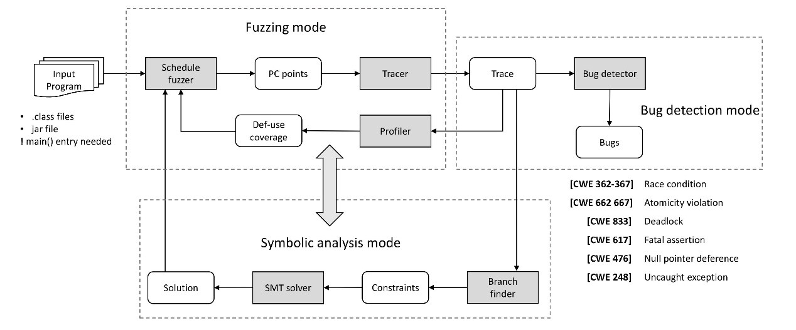
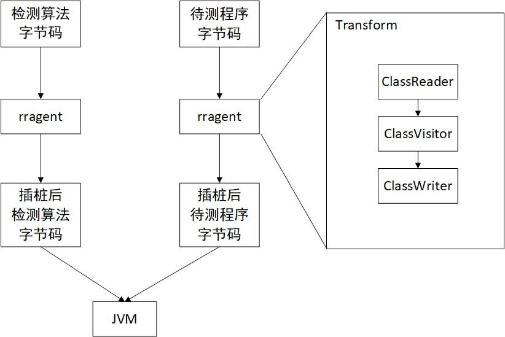
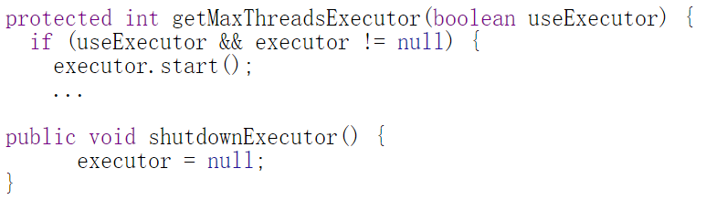

当前,随着计算机多核硬件的飞速发展，多线程并发程序越来越受到欢迎并被广泛使用。但是由于对共享内存空间访问的隐蔽性以及并发线程执行调度的随机性，导致多线程程序中很容易存在并发缺陷，而这些并发缺陷往往难以被发现或复现。现有的并发缺陷检测方法都有其局限性，例如基于系统测试和符号执行的检测方法无法适用于大规模的并发程序，因为存在状态空间爆炸的情况；基于概率调度的检测方法的命中缺陷率非常低。

为了解决当前并发程序测试面临的巨大挑战，DATE团队开发了基于程序动态测试技术的针对JVM应用的多线程并发缺陷检测工具DATE-Confu。该工具以待测JVM可执行程序（.class文件或.jar文件）为输入，输出为在待测程序中检测到的并发缺陷集合。目前，该工具可检测包括数据竞争、死锁、空指针引用等在内的六类严重并发缺陷，用户可根据需求选择检测哪些类型的并发缺陷。

DATE-Confu工具的创新点是其有效地结合了有目标的程序调度模糊测试技术（guided schedule fuzzing techniques）与基于符号执行的轨迹分析技术（symbolictrace analysis techniques）。下图为DATE-Confu工具的框架示意图。该工具使用模糊测试技术能够高效遍历多线程程序巨大的状态空间，并且基于符号执行的轨迹分析技术快速发现被测程序中尚未探索到的控制分支，从而为迭代模糊测试提供有效信息，使得DATE-Confu能更快达到更高的覆盖率。目前DATE-Confu已在多个工业级别的项目上进行测试，通过目前已经进行的实验发现，DATE-Confu的测试效率高且能挖掘到隐藏更深的并发缺陷。

<!-- more -->

DATE-Confu框架示意图

该工具在2017年全国软件及应用学术会议（NASAC 2017）软件原型竞赛（命题型）单元上获得了二等奖。NASAC从2008年开始组织原型系统交流。从2013年开始，软件工程专委与系统软件专委正式联合举办“软件研究成果原型竞赛”，NASAC 2017原型竞赛是第一次由大赛自主命题，选手准备工具，并在比赛现场进行测试和报告的竞赛。共有8个软件工具通过初审进入复赛，由来自企业界和学术届的评审委员会评出一、二、三等奖。

# 插桩

DATE-ConFu工具使用ASM字节码插桩框架实现插桩功能。ASM是一个可以操作Java字节码文件的框架，一般来说，对一个普通的java文件字节码操作流程有3步：

- 编译Java源代码得到Java字节码；
- 使用ASM框架的ClassReader读取字节码，使用访问者模式对字节码进行修改，然后使用ClassWriter生成新的字节码；
- 将新的字节码加载到JVM虚拟机运行。

总体插桩过程分为2个部分，第一个部分是DATE-ConFu工具利用Java Agent模式对检测算法所在的Java字节码进行插桩，第二个部分是检测到需要将被测模块的字节码加载到JVM运行时，再次调用Agent中的Trasform方法对被测模块的字节码进行拦截，对字节码插桩完毕后，最后将插桩后的字节码加载到JVM运行，此时在JVM上运行的字节码会调用DATE-ConFu中的检测算法进行缺陷检测。

字节码插桩流程

在插桩过程中，需要选择特定的字节码进行处理，避免对Java中通用的模块进行插桩带来不必要的输出，例如JDK中包含的模块会在Agent的Transform方法中被排除，通常被插桩的对象是被测字节码以及被测字节码引入的其他包内的字节码，所以需要确保被测字节码紧密相关的包内的字节码可以在运行时路径中被找到，或者使用排除指定类的命令行参数避免对指定类进行插桩。

# 线程调度

对多线程程序进行模糊测试的本质是在线程调度中引入随机性。目前一般的做法是在底层操作系统之前构造一个高层次调度器，这个调度器会通过强制执行上下文切换来控制调度。通常来说，实现上下文切换的做法是通过引入睡眠、优先级转换等操作。

在DATE-ConFu工具中，我们使用优先级转换操作来实现低开销的上下文切换并且可以避免引入死锁。为了生成多样的线程调度，现有的技术大多是实现在事件级别（event-level）的模糊测试。事件级别的模糊测试是指在一个特定事件之前或之后随机插入调度操作来实现上下文切换，例如在某个多线程程序中的每一个内存写操作之前都插入睡眠指令，能够使得不同的线程在执行内存写操作时交错开来。但是，由于实际应用程序中存在大量事件，在事件级别的模糊测试会导致命中缺陷的概率相对较低。

为了解决事件级别的模糊测试命中缺陷的概率较低的问题，在开发DATE-ConFu工具时我们提出了使用内存访问组技术（Memory Access Group, MAG）来优化调度中的模糊测试。内存访问组技术的核心是将一连串的内存访问各自分组并在每个组中执行调度模糊测试，这样能够有效缩小调度的状态空间，增加命中缺陷的概率。但是仅仅使用内存访问组技术进行优化还不足以使我们更有效地生成触发缺陷的轨迹，为了让线程调度模块更有效地找到程序中的并发缺陷，我们提出了一种基于内存访问组技术的随机模糊测试技术。该技术把模糊测试的过程建模成为一个搜索问题并引入蒙特卡罗马尔可夫链方法（Monte Carlo Markov Chain, MCMC）优化搜索从而得到最优的搜索解。

# FastTrack算法

数据竞争最基本的检测算法为happen-before与Lockset检测算法。随着研究的进一步发展，人们在这两个经典算法的基础之上进行不断的优化和改进，衍生出目前常用的算法。DATE-ConFu工具使用的FastTrack算法就是对happen-before算法进行优化从而高效地检测数据竞争并发缺陷。happen-before算法最基本的思想是记录每一次共享内存的访问，然后检测是否和前一次访问具有happen-before关系，如果不存在happen-before关系，就报告数据竞争，FastTrack算法的基本思想也是如此。但FastTrack算法进行了许多改进，使得算法的时间复杂度和空间负责度都得到了有效提升。

通过观察大量的程序可以获知，数据竞争检测中线程同步的操作相对读写操作来说，占较少的比例，而读写操作的占比高达96%，FastTrack算法成立的关键在于99%的读写操作的监视不需要采用完整的向量时钟，取而代之的使用一种更加轻量级的数据结构。FastTrack分别从数据竞争的三种情况进行讨论，分别是写写竞争，写读竞争，读写竞争。

# NPD检测算法

DATE-ConFu工具中用于检测空指针引用的算法。空指针应用缺陷可以参考CWE 476标准中的具体介绍说明。NPD检测算法依赖于：（1）并发偏序关系识别；（2）内存采样。算法流程总结如下：

1. 动态加载被测程序字节码
2. 字节码插桩，根据不同JVM字节码指令，插入内存采样接口。如针对PUTFIELD指令，栈顶元素为{value, objectref}，分别为写入内存的值，已经对象引用，此时内存采样接口捕获value值，在算法中进行维护。
3. 运行被测程序，产生运行时轨迹
4. 动态识别happen-before关系，判定不同线程中的特定操作（如内存访问、加解锁等）是否存在严格的并发偏序关系，即happen-before关系
5. 动态截获不满足happen-before关系的内存访问操作对($x_1$, $x_2$)，并保证$x_1$、$x_2$中为一次写操作和一次读操作
6. 在截获的($x_1$, $x_2$)内存操作对中，检查相应的内存访问值是否为null。如果为null，则说明在并发运行环境中，由于并发不确定性，可能导致对空对象的引用情况，造成程序崩溃

NPD算法可以看做是对FastTrack算法的一个扩展、精化，用于自动化定位并发操作中可能引发的空指针引用问题。如图所示，当该程序在多线程访问时，NPD检测算法能够自动捕获`(executor!=null, executor=null)`和`(executor.start(), executor=null)`两个并发内存访问对，并通过检查内存采样，确定`(executor.start(), executor=null)`可能引发的空指针引用问题。

空指针解引用问题

# GoodLock检测算法

多线程程序中，一个线程集合中的每一个线程都在各自等待另一个线程占据的互斥性资源，由此导致的循环等待即为死锁．在所有并发缺陷中，死锁是其中比较常见和的一种，而且若是死锁一旦发生，将可能导致多线程程序响应时间增长、吞吐量下降甚至宕机崩溃，严重威胁并发程序的可用性与可靠性．与其他并发缺陷一样，死锁具有难以暴露、重演和调试的特点。

DATE-ConFu工具检测死锁并发缺陷主要是通过实现GoodLock算法。GoodLock算法能够在运行时检测被测并发程序是否有可能发生死锁。该算法主要是通过构建加锁树的方式来进行判断，目前的GoodLock算法能够用来解决任意数量线程之间的死锁问题。该算法主要是将各个线程的加锁树连接起来形成一个加锁图，通过遍历所有可能的路径来寻找有效环路，从而判断程序是否有可能发生死锁。除此之外，GoodLock算法将运行时检测与静态分析相结合，在原先的基础上实现了新的类型系统，不仅可以检测Java程序中的死锁问题，并且可以提供更强的原子性保证。

