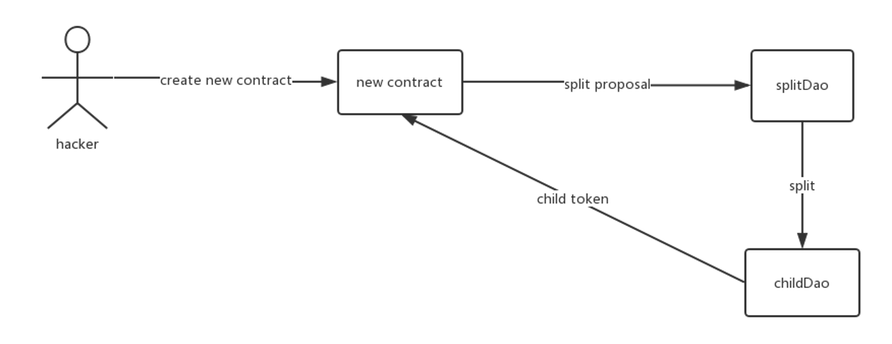
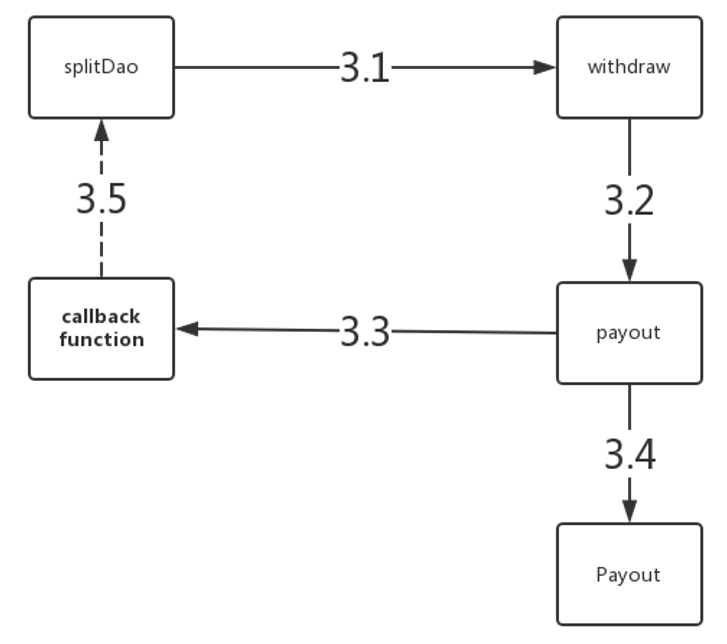
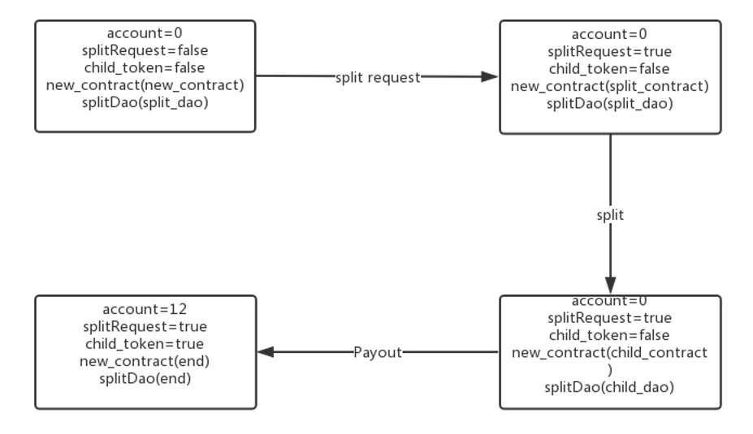
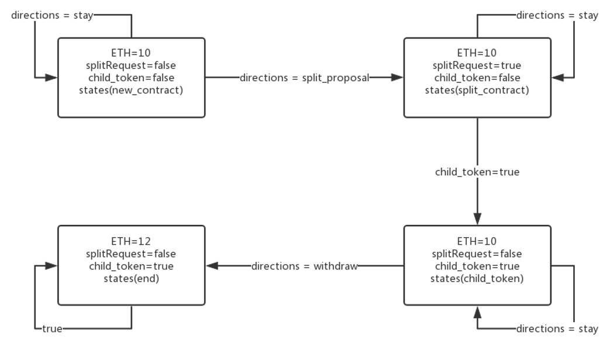
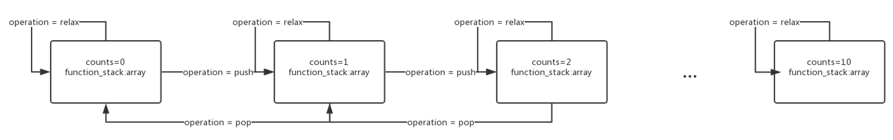
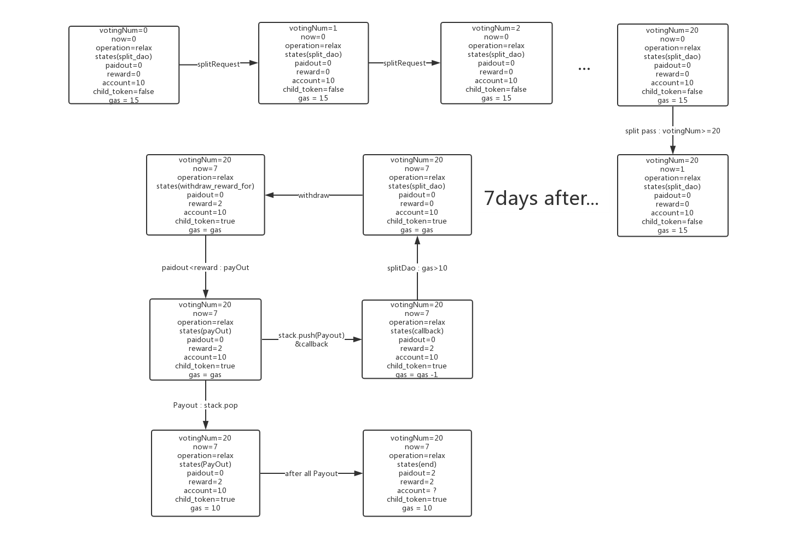

智能合约是一种代码合约和算法合同，将成为未来数字社会的基础技术，它利用协议和用户接口，完成合约过程的所有步骤。本文总结了智能合约主要技术特点和现存的可信，安全等问题，提出将形式化方法应用于智能合约的建模，模型检测和模型验证过程，以支持规模化智能合约的生成。

<!-- more -->

以太坊（英语：Ethereum）是一个开源的有智能合约功能的公共区块链平台[1][2]。通过其专用加密货币以太币（Ether，又称“以太币”）提供去中心化的虚拟机（称为“以太虚拟机” Ethereum Virtual Machine）来处理点对点合约。

以太坊最重要的技术贡献就是智能合约。智能合约是存储在区块键上的程序，可以协助和验证合约的谈判和运行。以太坊的智能合约可以数种用图灵完备的编程语言写成[3]。以太坊平台是一台由众多用户构成的网络来运转的公用电脑，并用以太币来分配和支付这台电脑的使用权[4]。智能合约可以让众多组织的数据库得以用低廉的成本交互，并且让用户写下精密的合约，功能之一是产生去中心化自治组织，也就是一间只是由以太坊合约构成的虚拟公司[5]。

因为合约内容公开，合约可以证明其宣称的功能是真实的，例如虚拟赌场可以证明它是公平的[6]。另一方面，合约的公开性也表示如果合约中有漏洞，任何人都可以立刻看到，而修正程序可能会需要一些时间[7]。The DAO就是一个例子，无法即时阻止[8]。

The DAO：DAO是Decentralized Autonomous Organization（分布式自治组织）的简称，the DAO是一个基于以太坊区块链平台的迄今为止世界上最大的众筹项目。其目的是让持有the DAO代币的参与者通过投票的方式共同决定被投资项目， 整个社区完全自制， 并且通过代码编写的智能合来实现。The DAO筹集到了1170万以太币（价值约2.45亿美元），并创造了众筹历史之最。

然而在2016年6月17日，运行在以太坊共有链上的The DAO智能合约遭遇攻击，该合约筹集的公众款项不断被一个函数的递归调用转向他的子合约，涉及总额300多万亿台币。智能合约的许多细节仍在研究中，包括如何验证合约的功能，如何大规模分析各个已发布的合约，发现找出合约中的漏洞。

由于The Dao是运行在以太坊的一个开源的项目，其代码在以太坊平台公布出来了，我们针对TheDao智能合约交易场景下的安全漏洞，通过NuSMV建模语言对该过程进行了抽象建模处理，然后通过NuSMV对该模型进行了验证，成功的找出了该智能合约在交易场景下的安全漏洞。随后，我们针对这一漏洞，在模型层面上对该智能合约进行了修复，然后再用NuSMV对模型进行验证，最后发现该漏洞已准确被修复。

# 问题描述

## The Dao交易流程解析



上图是攻击者攻击TheDao的主要流程图：

1. 首先，攻击者在TheDao中创建一个新的合同，
2. 然后利用这个合同，向splitDao发起split请求：
根据白皮书的设计，splitDAO的本意是要保护投票中处于弱势地位的少数派防止他们被多数派通过投票的方式合法剥削。通过分裂出一个小规模的DAO，给予他们一个用脚投票的机制，同时仍然确保他们可以获取分裂前进行的对外资助产生的可能收益。
3. 一旦splitDAO通过了split请求，它就会创建childDAO(如果不存在的话），并将分裂者拥有的Ether转入childDAO中（这是目前唯一可行的提取Ether的机制）
4. 最后，会将child token返回给原合同，这样提出split请求的人就有权限访问这个新分裂出来的childDao了。

到目前为止，这四个步骤中看上去没有任何异常发生，然而真正的危机，在第三步Ether转入childDao开始，已经悄然发生。下面我们来看第三个步骤中splitDao具体是如何转移Ether的。



3.1 splitDao首先会检查提议者的Id是否正常，提议者是否投出赞成票（通过第1，2步的正常流程，攻击者的这些验证信息能够很轻易的通过），检查通过后，splitDao就会发起withdraw请求，调用withdraw函数。
3.2 随后，withdraw函数通过一系列的计算，计算出需要转移的Ether数量，接着就调用payout函数。
3.3 根据TheDao的设计，payout函数会先调用用户原合同内自定义的callback函数(类似于通知用户split请求完成了，让用户可以做一些自定义的操作)。然后进行3.4操作，**调用真正的Payout函数（真正执行转账功能，是内部函数，不提供外部接口，是一个原子操作）**。

正常流程本应该像上述流程一样，按顺序执行完3.1，3.2，3.3，3.4后，转账成功，一切正常。
然而，问题恰恰出现在用户自定义的回调函数上面：攻击者在自定义的回调函数上，又再次的调用splitDao，发起withdraw操作。这样，正常的流程就变成3.1，3.2，3.3，3.5(3.4压入栈中)3.1，3.2，3.3，3.5… 这样无限递归下去了，直到callback停止3.5过程，停止调用splitDao，接着被压入栈中的许多步3.4Payout转账操作将会被重复执行多次，攻击者的账户也就凭空的多出了很多Ether。

# The Dao交易流程状态机

为了使用NuSMV对上述流程进行建模验证，我们首先需要对上述交易流程进行抽象建模，考虑到状态机模型与NuSMV模型的匹配度比较高，我们首先将该流程抽象建模成3个不同模块的状态机：user模块，contract模块以及splitDao模块。

## User模块主要状态机



对于User模块来说，主要包含4个重要状态：初始化状态，用户account为0，创建的合同为和splitDao均处于初始状态。随后，当处于初始状态的user发起split 请求后，splitRequest置为true，contract状态变为split_contract，spltDao接收到请求后分裂为childDao状态，同时contract状态更新为child_contract状态。最后，当splitDao完成了所有的Payout操作后，返回child_Dao的控制权child_token（将其设为true），同时将用户的account变更为12以太币，new_contract和splitDao的状态均更新为end.

## Contract模块主要状态机



对于contract模块来说，同样也包含4个最主要的状态：初始状态以太币设为10，合同状态为new_contract状态。当合同发起splt_proposal请求时，splitRequest状态置为true，合同状态置为split_contract状态。当splitDao创建完新的child_Dao后，将child_token置为true，同时合同的状态置为child_contract。最后合同发起withdraw请求，将以太币加上收入，更新为12，随后合同的状态置为end。

## splitDao模块主要状态机

由于Nusmv不支持函数调用，所以为了模拟出函数调用栈的行为，我们又创建出了建议的stack栈模块，它的主要状态机如下图所示：

### Stack模块状态机图



当发来的operation操作为push操作时，该栈会把当前状态存入function_stack数组中，并且对应的指针counts+1；当operation为pop时，会将function_stack数组中指针当前指向的状态返回，同时指针counts-1；当operation为relax时，状态不变。

### splitDao模块状态机核心状态图



splitDao初始状态投票数votingNum的值为0，当有合同发起split请求后，投票数目就会相应的增加1，当投票的数目达到某一个阈值（我们这里假设为20）后，splitDao开始进行split操作，当splitDao发起分裂请求后，时间now就会一直累加1，根据TheDao的设计，需要等待7天后，split操作才会完全生效，之后将会创建一个新的child_Dao，并将访问控制权child_token设置为true并返回给所有的split请求者。

之后，splitDao需要将原合同的Ether转到新的child_Dao中，并且计算全合同的reward值，一并转入到child_Dao。因此splitDao会发起withdraw请求，并将状态设为withdraw_reward_for状态。在这里，它会先检查paidout是否小于reward（这一步很重要，之后会详细的介绍），如果满足条件，它就会调用payout方法。

而在payout方法中，它首先会去调用用户原合同中自定义的callbackFunction，然后紧接着就会调用真实的转账函数Payout，若callback函数中递归调用spiltDao，那么每次payout调用真实转账函数Payout都会暂时将其压入栈中，直到递归结束，栈中实际转账任务依次执行。这里我们通过我们自己定义的简单栈模拟这一过程：每次调用callback之前将operation置为push，将PayOut操作push进入栈。当callback不在调用splitDao时，将operation置为pop，此时栈中的PayOut操作将会依次被pop出来执行。

最后，当所有的PayOut操作都执行完毕后，account的值将会被累加很多次，并且splitDao会将paidOut值置为paidOut+reward的值。

此外，值得注意的是TheDao引入了一个gas的概念：

合约执行会在所有节点中被多次重复，这个事实得使得合约执行的消耗变得昂贵，所以这也促使大家将能在链下进行的运算都不放到区块链上进行。对于每个被执行的命令都会有一个特定的消耗，用单位gas计数。每个合约可以利用的命令都会有一个相应的gas值。

每笔交易都被要求包括一个gas limit。如果该交易由于计算，包括原始消息和一些触发的其他消息，需要使用的gas数量小于或等于所设置的gas limit，那么这个交易会被处理。如果gas总消耗超过gas limit，那么所有的操作都会被复原，但交易是成立的并且交易费任会被矿工收取。区块链会显示这笔交易完成尝试，但因为没有提供足够的gas导致所有的合约命令都被复原。所以交易里没有被使用的超量gas都会以以太币的形式打回给交易发起者。

因此，这里攻击者为了避免gas被用完的情况，它在自定义的callback函数中，将会通过对gas进行一定数量上的限制(这里我们假设为gas=10)来递归的调用splitDao函数

# 漏洞修复

通过splitDao关键状态机的流程分析，我们可以很容易的发现问题所在：

首先，在withdraw函数中，在调用payout之前，系统为了不重复调用payout，是会对reward的值和paidOut的值进行比较的，而且当真实的PayOut函数执行完毕后，确实是会将reward的值加到paidOut上。

然而攻击者巧妙的地方在于利用调用栈的机制，递归的调用splitDao的withdraw函数，由于前一次应该执行的PayOut函数还在栈中没有被执行，因此paidOut的值也没有变化，理所当然能通过withdraw函数的检查机制，最后造成多次递归转账的行为。

当了解了这一机制后，要想修复掉这个问题也变得十分的简单：
只需要将paidOut值改变的地方放在payOut函数调用之前，而不是之后。
只需要做这一个小小的改动，之后就算callback函数递归调用splitDao的withdraw函数，该函数的检查机制会发现先paidOut的值已经发生改变，不再小于reward，说明payout已经被调用过，就不会再去递归调用了，这一漏洞也顺利的解决了。

# NuSMV建模过程

## 属性介绍

|main模块|类型|含义|
|:---:|:---:|:---:|
|gas|integer|能量，为0时交易停止|
|user|user|用户，拥有合约，传入参数为能量|

|User模块|类型|含义|
|:---:|:---:|:---:|
|account|integer|用户账户的余额|
|splitRequest|boolean|分裂合约的请求|
|child_token|boolean|标志可以取钱的许可|
|new_contract|contract|合约|
|split_dao|splitDao|分裂出子DAO的过程|

|contract模块|类型|含义|
|:---:|:---:|:---:|
|ETH|integer|以太币，以太坊平台上的货币|
|states|enumeration|合约的状态，可以取的状态有新建合约、分裂合约、子合约、终止状态|
|directions|enumeration|合约转移的方向，可取的值有提出分裂请求、取钱、保持当前状态|

|stack模块|类型|含义|
|:---:|:---:|:---:|
|counts|integer|记录当前栈的深度|
|function_stack|array|使用数组构造栈，取值有callback_function、PayOut，代表回调函数和付款|

|splitDao模块|类型|含义|
|:---:|:---:|:---:|
|votingNum|integer|投票数目|
|votingFloor|integer|投票通过最低阈值|
|votingDeadline|integer|投票截止日期|
|now|integer|当前日期|
|operation|enumeration|栈的操作，取值为stackpush、stackpop、relax，分别表示压入元素、弹出元素和无操作|
|pushStates|enumeration|压入栈的元素，取值有callback_function、PayOut，代表回调函数和付款|
|popStates|enumeration|弹出栈的元素，取值有callback_function、PayOut，代表回调函数和付款|
|states|enumeration|状态|
|paidout|integer|累计收益|
|reward|integer|通过分裂合约得到的收益|
|functionStack|stack|栈结构|
|accumulatedInput|integer|计算收益reward的变量|
|totalSupply|integer|计算收益reward的变量|
|balanceOf|integer|计算收益reward的变量|

## 流程说明

根据第二节中介绍的三个模块的状态机模型，我们将其翻译成了NuSMV模型，具体实现细节详见代码。之后，我们通过设置NuSMV的断言：**SPEC AG !(user.new_contract.ETH > 12)**;
来判断攻击者是否成功利用漏洞获取了额外的Ether。
按照正常流程，用户进行split操作应该会获得本金10Ether+原合同收益2Ether共12Ehter。因此，若中间某个流程使得用户的以太币变得大于12Ehter，说明该智能合约存在漏洞。
随后通过NuSMV验证指令对该模型进行验证。

## 验证结果

通过上述流程，NuSMV的模型验证结果如下所示：

```bash
-- specification AG !(user.new_contract.ETH > 12)  is false
-- as demonstrated by the following execution sequence
Trace Description: CTL Counterexample 
Trace Type: Counterexample 
  -> State: 1.1 <-
    gas = 15
    user.account = 0
    user.splitRequest = FALSE
    user.child_token = FALSE
    user.new_contract.ETH = 10
    user.new_contract.states = new_contract
    user.new_contract.directions = stay
    user.split_dao.votingNum = 0
    user.split_dao.votingFloor = 20
    user.split_dao.votingDeadline = 7
    user.split_dao.now = 0
user.split_dao.operation = relax
…
  -> State: 1.31 <-
    user.split_dao.now = 8
    user.split_dao.states = withdraw_reward_for
  -> State: 1.32 <-
    user.split_dao.now = 9
    user.split_dao.reward = 2
  -> State: 1.33 <-
    user.split_dao.now = 10
    user.split_dao.operation = stackpush
    user.split_dao.states = payOut
 …
  -> State: 1.57 <-
    user.splitRequest = FALSE
    user.new_contract.ETH = 14
    user.new_contract.directions = split_proposal
    user.split_dao.votingNum = 23
    user.split_dao.paidout = 4
    user.split_dao.functionStack.counts = 3
```

结果说明该模型中确实存在漏洞，会使得用户获得额外的以太币。

## 修复过程与再次验证

根据第二节漏洞修复小节介绍分析的修复方案，我们将paidout值由：

```bash
next (paidout):=
            case
                states = PayOut & paidout<90 : paidout + reward;
                TRUE:paidout;
            esac;
```

转变为：

```bash
next (paidout):=
            case
                states = payOut & paidout<90 : paidout + reward;
                TRUE:paidout;
            esac;
```

为了验证我们修改后，不仅能够修复掉之前的漏洞，还能够使得该智能合同能够按照原来的设计正常的程序走下去。也就是意味着，即使攻击者写了异常攻击代码，我们也会按照正常的业务逻辑给予其正常数目的以太币。

因此我们又加了一条NuSMV断言：**SPEC AG !(user.new_contract.ETH = 12)**

判断经过最后整体流程之后，用户合同中的账目是不是12以太币.

修改后的模型验证结果如下所示：

```bash
-- specification AG !(user.new_contract.ETH > 12)  is true
-- specification AG !(user.new_contract.ETH = 12)  is false
-- as demonstrated by the following execution sequence
Trace Description: CTL Counterexample 
Trace Type: Counterexample 
  -> State: 1.1 <-
    gas = 15
    user.account = 0
    user.splitRequest = FALSE
    user.child_token = FALSE
user.new_contract.ETH = 10
…
  -> State: 1.36 <-
    user.split_dao.operation = stackpop
    user.split_dao.states = withdraw_reward_for
  -> State: 1.37 <-
    user.split_dao.operation = relax
    user.split_dao.states = PayOut
    user.split_dao.functionStack.counts = 0
  -> State: 1.38 <-
    user.new_contract.ETH = 12
    user.new_contract.directions = split_proposal
    user.split_dao.states = end
```

结果说明:

1. 原TheDao交易流程中存在的漏洞已经被我们修复成功。
2. 修复后的模型能够按照正常预期的流程运行。

# 总结

本次实验我们通过阅读以太坊上TheDao的开源代码，理解带有漏洞的交易流程，然后针对该流程将其转换为与NuSMV相似性较高的状态机模型。最后通过NuSMV的模型验证功能成功的复现了TheDao智能合约中的安全漏洞问题。

最后，针对TheDao中的漏洞，进行了模型层面的修复，然后使用NuSMV对修复后的模型进行再次检验，最后验证结果证明：我们成功地修复了原来的安全漏洞并且没有破环原来的正常逻辑流程。

通过TheDao这个验证实例我们可以看出，智能合约中确实存在着一些可信与安全问题，而形式化验证的方法能够比较好的用于智能合约的生命周期验证，一个好的模型检测工具有助于检查和验证智能合约中的各项属性，从而保证智能合约的安全性。

# 参考文献

[1]	Gray, Jeff. Bitcoin believers: Why digital currency backers are keeping the faith. The Globe and Mail (Phillip Crawley). 7 April 2014 [17 February 2016].
[2]	Vigna, Paul. BitBeat: Microsoft to Offer Ethereum-Based Services on Azure. The Wall Street Journal (Blog). News Corp. 28 October 2015 [17 February 2016].
[3]	Jon, Evans. Vapor No More: Ethereum Has Launched. techcrunch.com. [25 February 2016].
[4]	Nathaniel Popper for the New York Times. March 27, 2016 Ethereum, a Virtual Currency, Enables Transactions That Rival Bitcoin’s.
[5]	The great chain of being sure about things. The Economist. 31 October 2015 [4 May 2016].
[6]	Piasecki, Piotr J. Gaming Self-Contained Provably Fair Smart Contract Casinos. Ledger. 2016, 1: 99–110. doi:10.5195/ledger.2016.29.
[7]	Peck, M. Ethereum’s 150-Million Blockchain-Powered Fund Opens Just as Researchers Call For a Halt. IEEE Spectrum. Institute of Electrical and Electronics Engineers. 28 May 2016.
[8]	Popper, Nathaniel. Hacker May Have Taken 50 Million From Cybercurrency Project. The New York Times. 17 June 2016.
