人脸识别的研究历史比较悠久。Galton早在 1888 年和 1910 年就分别在《Nature》杂志发表了两篇关于利用人脸进行身份识别的文章，对人类自身的人脸识别能力进行了分析。但当时还不可能涉及到人脸的自动识别问题。近年来，人脸识别研究得到了诸多研究人员的青睐，涌现出了诸多技术方法。尤其是1990年以来，人脸识别更得到了长足的发展。几乎所有知名的理工科大学和主要IT产业公司都有研究组在从事相关研究。

初期，传统的人脸识别通常只是作为一个一般性的模式识别问题来研究，所采用的主要技术方案是基于人脸几何结构特征（Geometric feature based）的方法。这集中体现在人们对于剪影（Profile）的研究上，人们对面部剪影曲线的结构特征提取与分析方面进行了大量研究。随后，Eigen Face, Fisher Face和弹性图匹配等基于人脸表观的建模方法不断被提出。从1990年末期开始，大家开始关注面向真实条件的人脸识别问题，提出了不同的人脸空间模型，包括以线性判别分析为代表的线性建模方法，以Kernel方法为代表的非线性建模方法和基于3D信息的3D人脸识别方法。提出了新的特征表示，包括局部描述子（Gabor Face, LBP Face等）和深度学习方法。

2014年以来，深度学习+大数据（海量的有标注人脸数据）已经成为人脸识别领域的主流技术路线，其中VGGFace，DeepFace，FaceNet等深层神经网络不断被提出，人脸识别准确率也不断的提升。2014年，Facebook发表于CVPR14的工作DeepFace将大数据（400万人脸数据）与深度卷积网络相结合，在LFW数据集上逼近了人类的识别精度。Google发表于CVPR2015的工作FaceNet采用Triplet Loss损失函数在LFW数据集上超越了人类的识别精度。

<!-- more -->

# 相关工作

人脸识别任务常用的数据集包括LFW数据集，LFW数据库是真实条件下的人脸识别问题的一个测试基准。LFW数据集包括来源于Internet的5,749人的13,233张人脸图像，其中有1680人有两张或以上的图像。LFW的标准测试协议包括6000对人脸的十折确认任务，每折包括300对正例和300对反例，采用十折平均精度作为性能评价指标。

Google于2015年首次提出FaceNet, 一个在LFW数据集上十折平均精度高达到99.63%，也是当所有工作中最高的一个结果，几乎宣告了LFW上从2008年到2015年长达8年之久的性能竞赛的结束。FaceNet采用了22层的深层卷积网络和海量的人脸数据（800万人的2亿张图像）以及常用于图像检索任务的Triplet Loss损失函数。FaceNet并没有用传统的softmax的方式去进行分类学习，它去掉了sofmax后的结构，经过L2的归一化，然后得到特征表示，基于这个特征表示计算三元组损失。使用元组计算距离的方式来进行模型的训练，这种方式学到的图像表示非常紧致，128位足以表示其特征。

VGGFace是牛津大学视觉研究所于2015提出的，他们采用VGGNet作为网络架构，网络的最后一层是分类器(W,b)，分类的误差用softmax log-loss来计算。一旦学习过程完成后，就可以把分类器(W,b)去除，分数向量ϕ(lt)便可以作为特征通过计算欧式距离进行人脸校验。 上面得到的分数向量能够进一步得到改善，通过在欧式空间里面使用“triplet loss”的方式进行训练。它最终在LFW模型上的准确率为98.95%。

2016年提出的MTCNN是一种高效的人脸检测方法。MTCNN由3个网络结构组成（P-Net,R-Net,O-Net）。Proposal Network (P-Net)：该网络结构主要获得了人脸区域的候选窗口和边界框的回归向量。并用该边界框做回归，对候选窗口进行校准，然后通过非极大值抑制（NMS）来合并高度重叠的候选框。 Refine Network (R-Net)：该网络结构还是通过边界框回归和NMS来去掉那些false-positive区域。只是由于该网络结构和P-Net网络结构有差异，多了一个全连接层，所以会取得更好的抑制false-positive的作用。Output Network (O-Net)：该层比R-Net层又多了一层卷积层，所以处理的结果会更加精细。作用和R-Net层作用一样。但是该层对人脸区域进行了更多的监督，同时还会输出5个landmark。

# 实验方法

## 人脸对齐

由于获得的人脸图像常常形状各异，这时就需要对人脸形状进行统一处理方便进行比较。具体使用的对齐操作主要有切割出人脸、对人脸进行旋转，其目的主要是去除背景噪声对人脸比较的影响，使得2个人脸尽量在提取出有效特征的前提下进行比较。

### 利用opencv的haar特征提取人脸

由于haar特征值反映了图像的灰度变化情况，所以加载opencv训练好的脸部的特征的xml文件[1]可以用来提取人脸，具体使用过的xml特征文件如下：

```
haarcascade_frontalface_default.xml
haarcascade_frontalface_alt.xml
haarcascade_frontalface_alt2.xml
haarcascade_frontalface_alt_tree.xml
haarcascade_profileface.xml
```

其中前4个xml文件用于提取正脸，后4个xml文件用于提取侧脸，提取出的示例如下图：

|原始图片|提取后图片|
|:---:|:---:|
|||

实际提取的效果如下表：

|训练集提取数目|训练集提取百分比|测试集提取数目|测试集提取百分比|
|:---:|:---:|:---:|:---:|
|1569|78.45%|1554|77.7%|

### 利用MTCNN提取人脸

MTCNN是发表在ECCV 2016的工作，采用级联的卷积神经网络进行人脸五官特征点检测，适用于人脸对齐的任务。

这里使用的是实现在MxNet框架下的MTCNN进行人脸对齐，实验示例如下图：

|原始图片|提取后图片|
|:---:|:---:|
|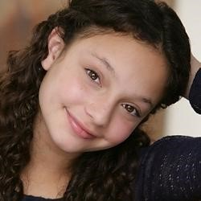|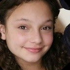|

|训练集提取数目|训练集提取百分比|测试集提取数目|测试集提取百分比|
|:---:|:---:|:---:|:---:|
|1965|98.25%|1971|98.55%|

相比于opencv和haar特征提取人脸的方法，MCTNN不仅能提取出更多的人脸，而且能对倾斜的人脸进行旋转，得到正脸能有效提高提高比较人脸时的准确率。

## 数据增广

在深度学习中，增加数据量能提高模型的泛化能力。主要采用Keras的ImageDataGenerator和imgaug进行数据增广。

### 利用ImageDataGenerator进行数据增广

ImageDataGenerator是Keras提供的API，主要提供的数据增广方式如下：

- 旋转 | 反射变换(Rotation/reflection): 随机旋转图像一定角度；改变图像内容的朝向
- 翻转变换(flip): 沿着水平或者垂直方向翻转图像
- 缩放变换(zoom): 按照一定的比例放大或者缩小图像
- 平移变换(shift): 在图像平面上对图像以一定方式进行平移；可以采用随机或人为定义的方式指定平移范围和平移步长, 沿水平或竖直方向进行平移. 改变图像内容的位置
- 尺度变换(scale): 对图像按照指定的尺度因子, 进行放大或缩小； 或者参照SIFT特征提取思想, 利用指定的尺度因子对图像滤波构造尺度空间. 改变图像内容的大小或模糊程度
- 对比度变换(contrast): 在图像的HSV颜色空间，改变饱和度S和V亮度分量，保持色调H不变. 对每个像素的S和V分量进行指数运算(指数因子在0.25到4之间), 增加光照变化
- 噪声扰动(noise): 对图像的每个像素RGB进行随机扰动, 常用的噪声模式是椒盐噪声和高斯噪声

实际产生的数据增广例子如下图所示：

|增广样例1|增广样例2|增广样例3|增广样例4|
|:---:|:---:|:---:|:---:|
|||||

### 利用imgaug进行数据增广

imgaug[2]是一个封装好的用来进行图像增广的python库，支持多种图像变换。

主要支持的图像变换功能如下：

- 图像缩放
- 图像截取(crop)或者填充(pad)
- 水平镜面翻转、上下翻转
- 变成灰度图
- 高斯扰动
- 锐化
- 浮雕效果
- 图像变亮或变暗

实际产生的数据增广例子如下图所示：

|增广样例1|增广样例2|增广样例3|增广样例4|
|:---:|:---:|:---:|:---:|
||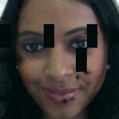||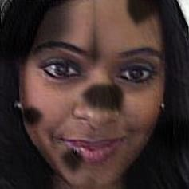|

实际实验共生成了91702张训练图片，平均每张训练集图片生成44.85张数据增广图片。

## 基于VGGFace进行Finetune

在Github上，作者rcmalli使用Keras在VGGFace数据集训练了人脸识别模型[3]，其使用的架构如下：

- VGG16
- RESNET50
- SENET50
- 
作者基于这3种网络架构，使用牛津大学VGGFace的人脸数据训练了用于人脸识别的网络。本次实验基于RESNET50架构的网络模型，保留其全连接层之前的权重，使用数据增广后的训练集图片对全连接层进行Finetune，训练过程中训练集和测试集的精度变化曲线如下：

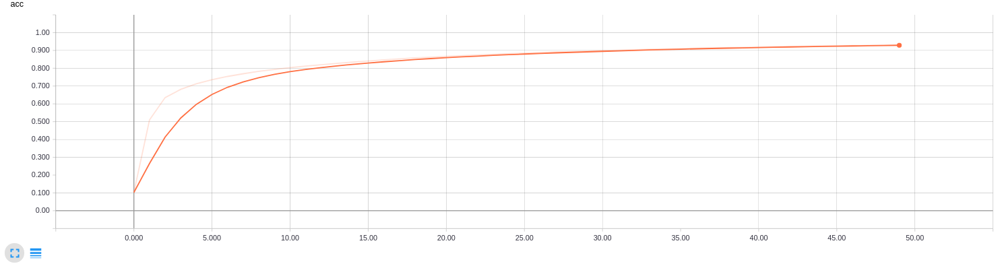

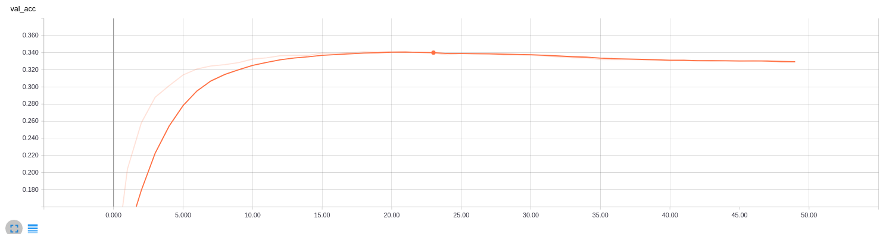

可以看出，经过50轮训练，训练集最高准确率达到0.9307，测试集最高准确率达到0.3375。
经过测试，得到Top 1准确率为0.3375，Top 5准确率为0.489。

## 基于FaceNet进行Lazy Learning

2015年Google的研究人员提出了FaceNet，其通过训练一个网络来得到人脸的128维特征向量，从而通过计算特征向量之间的欧氏距离来得到人脸相似程度。

在Github上，作者davidsandberg使用Inception ResNet v1架构，基于VGGFace2的数据训练的FaceNet[4]在LFW上评测精度达到0.9965。

Lazy Learning的思想是计算测试样本与训练集样本的距离，所以仿照Lazy Learning的做法对于每个测试的人脸图片，计算其与所有训练集人脸的相似度，对得到的距离从低到高进行排列，从而返回与测试图片最相近的训练集人脸图片。

提取人脸的过程如下图所示：

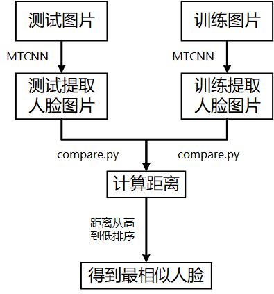

FaceNet使用MTCNN提取输入图片的人脸部分，之后使用作者提供的compare.py计算给定2个图片的相似度，实验的过程中每张测试集的图片都需要与训练集的2000张图片的计算相似度，可以通过预先计算好图片提取人脸后的结果保存在硬盘上，然后计算人脸距离时读取之前保存的人脸提取的结果即可，这样可以极大的加快计算人脸距离的速度。

最终得到的人脸距离示例如下：

```
0          0       1.3858
0          1       1.3257
0          2       1.5103
0          3       1.1707
0          4       1.0327
0          5       1.4050
0          6       1.5472
0          7       1.3509
0          8       1.3133
0          9       1.4988
```

第1列为测试图片的下标，第2列为训练图片的下标，第3列为图片的距离。

对所有图片的距离小到大排列后，输出其top 5下标，示例结果如下：

```
120:332,120,1534,405,356
121:121,193,1536,1252,1984
122:122,987,1165,780,1317
123:123,1077,1154,135,1222
124:550,600,124,1292,589
125:953,549,125,1981,1729
126:126,138,1820,1699,462
127:127,1003,1013,1441,325
128:201,817,1002,2,717
```

第一列是测试集图片下标，“:”后是训练集中距离最近的top 5图片的下标。

经过测试，使用原始的facenet自带模型，得到Top 1准确率为0.446，Top 5准确率为0.6115。

## FaceNet Finetune

之前直接使用facenet的原始模型，里面没有这2000张人脸的信息。因此，我们基于原始的facenet模型，使用2000人脸图片作为训练集重新进行fine-tune

1. loss：softmaxloss + centerloss + 正则项之和 ；训练集为2000张训练图片以及2000张对应的灰度图片. 加载facenet在vgg上的模型，进行finetune
2. loss：triploss ； 训练集为2000张训练图片以及8000张对应的增广图片，加载facenet在vgg上的模型，进行finetune

取得finetune后的模型后，已然按照上述过程对图片进行KNN（k=1,距离度量：欧式距离）分类器的训练。

## 集成分类器

三个基分类器的diversity主要体现在下面几点:

- Fine-tune时 参数，loss函数和训练图片不同
  - 第一个模型:没有fine-tune
  - 第二个模型:softmaxloss + 2000张训练图片以及2000张对应的灰度图片
  - 第三个模型:triploss + 2000张训练图片以及8000张对应的增广图片
- 提取特征时，图片处理方式不同
  - 第一个模型:原始图片使用MTCNN处理
  - 第二个模型:原始图片使用MTCNN和Opencv同时处理
  - 第三个模型:灰度图片使用MTCNN和Opencv同时处理

最终集成的结果Top 1准确率为0.6975，Top 5准确率为0.821。

# 可视化

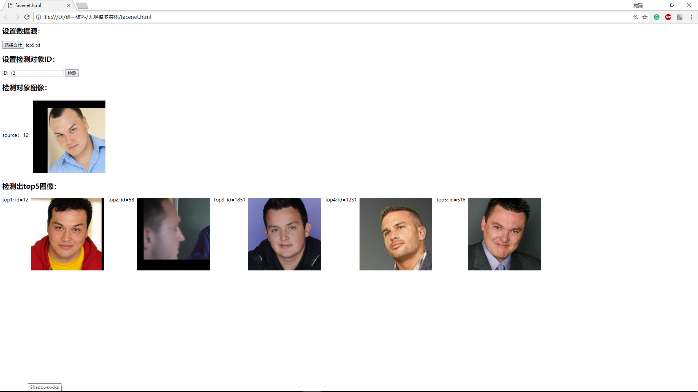

|导入模型跑出来的最终结果数据|输入待检测对象ID（id与所给测试集一致）|
|:---:|:---:|
|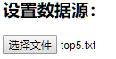|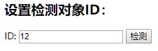|

最后会展示最接近的5个人脸结果:

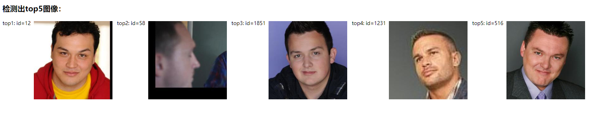

# 结论与思考

经过测试，得到Top 1准确率为0.6975，Top 5准确率为0.821。

限于时间和资源的关系，可以改进和提升的点如下：

- 可以对dlib、haar特征和MTCNN这3种人脸对齐的方法进行集成，可以更好地从训练图片和测试图片中切割出人脸区域，提高人脸比对的精确度
- 可以考虑对眼睛、鼻子和耳朵等五官特征进行提取之后使用神经网络进行训练，会涉及到大量的人工给数据打标签的工作和五官特征提取方法的调研，然后对于每个五官特征训练出的分类器进行集成，利用多数投票机制根据五官特征的匹配结果匹配人脸，可能准确率会更高。
- 通过人工分析，发现分类器出错的图片主要为人的正侧脸匹配错误，可以通过一些技术，例如tp-gan，把侧脸图片转为正脸图片

# 参考资料

[1] https://github.com/opencv/opencv/tree/master/data/haarcascades
[2] https://github.com/aleju/imgaug
[3] https://github.com/rcmalli/keras-vggface
[4] https://github.com/davidsandberg/facenet
