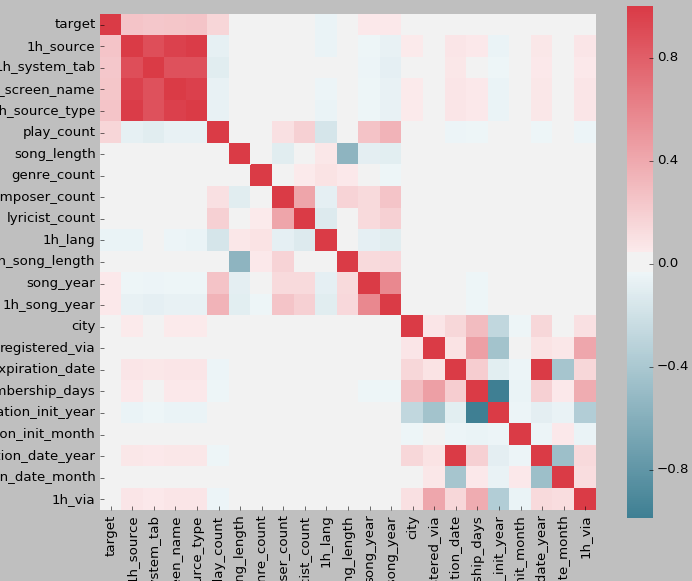
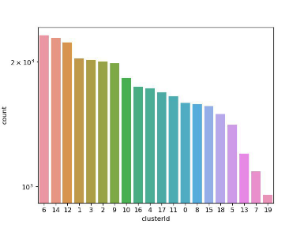
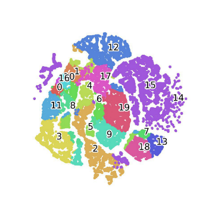
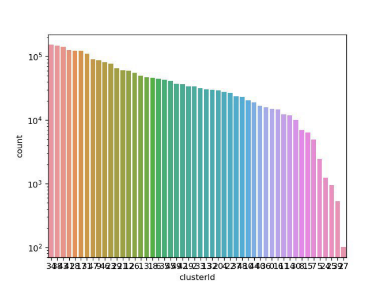
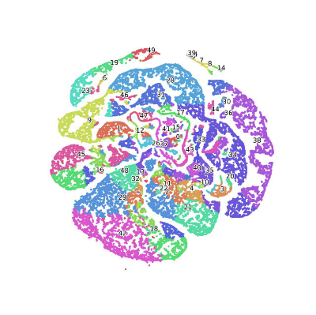
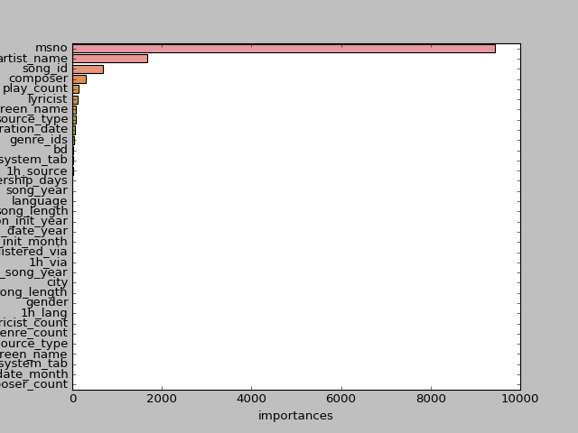

KKBOX是亚洲领先的音乐流媒体服务，拥有全球最全面的亚洲流行音乐库。本文在KKBOX提供给Kaggle社区的音乐数据集上进行了数据挖掘分析。通过对数据集进行初步的清洗的分析，我们提出了4个与数据挖掘相关的问题，分别为数据集中各特征的关联性分析、对歌曲的聚类、对用户的聚类以及预测某个用户一个月内是否会重复听某一首歌，然后选取合适的算法，例如 K-prototypes聚类算法、t-SNE高维数据可视化算法、LightGBM算法等来解决数据挖掘问题，最后给出相应的结论，从而实现在真实数据集上利用数据挖掘相关算法进行探索，将数据挖掘课堂上的知识转化为真正用得上的技术。

<!-- more -->

# 引言

本文使用KKBOX提供给Kaggle社区的音乐数据集中的4张表——members.csv、songs.csv、song_extra_info.csv和train.csv，提出了4个数据挖掘问题，并以4个问题为导向来对KKBOX数据集进行分析。这4个问题分别是：

1. 数据集中各特征的关联性分析
数据集中的各组特征具有内在的关联关系，因此特征值的关联性分析能够帮助更好理解数据之间潜在的联系，从而提取出有助于预测用户听歌习惯的重要特征。

2. 对用户的聚类
对听歌用户进行聚类分析，目的是找出相似的用户，有助于KKBOX更好地进行用户群定位。

3. 对歌曲的聚类
对歌曲进行聚类分析，有利于衡量歌曲之间的相似性，将相似的歌曲分到近似的簇中，从而确定歌曲库中海量歌曲的类别，帮助听歌用户更快找到喜欢的音乐。

4. 预测用户听歌行为
通过预测某个用户一个月内是否会重复听某一首歌，以便更好地为听歌用户推荐曲目，为用户提供更加个性化的音乐服务。

本文结构分为：第一章为引言，概述任务问题与文章结构；第二章介绍相关方法；第三到六章介绍4个数据挖掘问题的解决过程与结果，第七章是本次实验的总结与思考。

# 相关方法

## 皮尔逊相关系数

在自然科学领域中，皮尔逊相关系数广泛用于度量两个变量之间的相关程度。两个变量之间的皮尔逊相关系数定义为两个变量之间的协方差和标准差的商：

$$p_{x,y}=\frac{cov(X,Y)}{\sigma_X \sigma_Y}=\frac{E[(X-\mu_X)(Y-\mu_Y)]}{\sigma_X \sigma_Y}$$

由公式可知，皮尔逊相关系数是用协方差除以两个变量的标准差得到的，协方差能反映两个随机变量的相关程度，协方差大于0的时候表示两者正相关，小于0的时候表示两者负相关。

## K-prototypes聚类算法

K-prototypes 算法是由Huang[1]等提出的能够对混合数值属性和分类属性数据进行聚类的一种有效算法.该算法将K-means与K-modes算法结合起来，引入参数y来控制数值属性和分类属性在聚类过程中的权重。K-prototypes算法主要分为四个步骤：

1. 从数据集中随机选择k个数据对象作为初始的簇中心
2. 计算每个数据对象到各簇中心的距离，将其划分到距离最近的簇中，每一次划分结束后更新簇中心
3. 当所有对象都分配到相应的簇后，重新计算这些数据对象到当前簇中心的距离，将数据对象分配到离其最近的簇中心所在的簇中
4. 重复步骤3，直到各个簇中数据对象稳定

## t-SNE算法

T-SNE(t- Distributed Stochastic Neighbor Embedding)算法[3]是基于SNE算法[2]改进而来的，应用t-SNE算法可以基于高维数据的内在结构，将其在低维空间内展示出来，揭示数据内在的分类特点。SNE是通过仿射变换将数据点映射到概率分布上，主要包括两个步骤：

1. SNE构建一个高维对象之间的概率分布，使得相似的对象有更高的概率被选择，而不相似的对象有较低的概率被选择
2. SNE在低维空间里在构建这些点的概率分布，使得这两个概率分布之间尽可能的相似。通过将聚类结果的高维信息进行降维可视化，可以方便的观测和分析高维聚类结果。

## LightGBM算法

LightGBM是基于决策树算法的分布式梯度提升框架。LightGBM利用以下方法解决传统GBDT(梯度提升决策树)算法中存在的高维数据的效率和可扩展性问题：基于Histogram的决策树算法；带深度限制的Leaf-wise的叶子生长策略；直方图做差加速；直接支持类别特征；Cache命中率优化；基于直方图的稀疏特征优化；多线程优化等。Ke[4]等人提出了LightGBM算法实现GBDT，使得传统的GBDT训练过程加速了20倍以上，并且达到了几乎相同的精度。

# 数据集中各特征的关联性分析

## 数据处理

我们选取train.csv作为数据来源，首先对该数据集进行了筛选、清洗和量化，例如统计了音乐流派的数量、作词作曲家的数量，对language、system_tab、screen_name、source_type、年份等属性进行了one hot处理，对歌曲的长度做了简单的0-1二分类，此外还进行了一些数据清洗、缺失值的填补以及异常数据的处理。

## 关联性分析实验

经过处理，我们得到了23个维度的特征，利用Python中Pandas的相关性分析函数，通过皮尔逊相关系数，计算每个维度两两之间的相关性。实验结果如下图所示：

图1 不同维度特征之间的相关性

从实验结果可以得出以下结论：1h_source、1h_system_tab、1h_screen_name、1h_source_type这4个变量之间的相关性较高，而其他维度的关联性较低。1h_source指重播概率，1h_system_tab指触发重播事件的途径，1h_screen_name指触发重播事件的页面，1h_source_type指触发重播事件的来源，1h代表对这些字段进行了one hot处理，听歌方式、听歌页面和歌曲来源本身具有很强的关联性，例如一个用户的重播方式是通过搜索的途径在搜索页面收听在线的歌曲列表，因此正常情况下搜索途径、搜索页面和在线歌曲列表这3者是常常关联在一起发生的。而且这3个属性都是描述重播这一行为的，因此它们与重播率之间都具有很强的关联关系。

# 用户聚类

## 数据处理

对member.csv和train.csv这2个数据集的原始数据进行了处理，统计了注册时间的年/月/日、注销时间的年/月/日、成为会员的时间、该用户的播放歌曲总数、重播歌曲总数、重播率，对缺失的性别属性做了处理(男-0，缺失-1，女-2)。

## 用户聚类实验

由于数据中存在用户id、用户名称等离散属性，所以使用K-prototypes 算法对经过处理后的用户数据进行k为20的K-means聚类，并将聚类过程迭代100次。得到聚类结果后，对20个聚类进行了初步的统计，如图2所示：

|图2 用户聚类簇内记录统计|图3 用户聚类t-SNE可视化效果图|
|:---:|:---:|
|||

从图2可知，最大簇中有超过2000个点，最小簇中只有几百个点，总体上分布较为均匀。由于聚类结果是高维数据，我们使用t-SNE算法对其进行降维可视化以分析聚类的结果，如图3所示。一般来说聚类内的数据点聚集在一起的密度越高，离中心点越近，那么这个聚类的总体质量相对来说就会越好。从图3可以看出同一类别的点大部分都成簇出现，说明同一类别中的用户相似度较高。

# 歌曲聚类

## 数据处理

与用户聚类的过程类似，对songs.csv和train.csv这2个数据集的原始数据进行了处理，统计了歌曲年份、流派数量、歌手数量、作词家数量、作曲家数量、每首歌被播放次数、被重播次数，对于歌曲缺失的年份，使用年份的众数填补。

## 歌曲聚类实验

同理，由于数据中存在歌曲id、歌手姓名等离散属性，所以使用K-prototypes 算法对经过处理后的歌曲数据进行k为50的K-means聚类，并将聚类过程迭代200次。得到聚类结果后，对50个聚类进行了初步的统计，如图4所示：

|图4 歌曲聚类簇内记录统计|图5 歌曲聚类t-SNE可视化效果图|
|:---:|:---:|
|||

从图4可知，最大簇中有超过100000个点，最小簇中只有100个点左右，总体上分布较为均匀。

同样使用t-SNE算法对其进行降维可视化以分析聚类的结果，如图5所示。图5中属于同一类的歌曲用一种颜色标注，共有50个类，而且从图中可以观察到同一类别的点大部分都成簇出现，说明同一类别中的歌曲相似度较高。

以周杰伦的两首歌的聚类结果为例：

|聚类结果|
|:---:|
|253492,465,周杰倫 (Jay Chou),周杰倫,方文山,3.0,園遊會,TWK970400709,6|
|166661,458,周杰倫 (Jay Chou),周杰倫,方文山,3.0,公公偏頭痛,TWK971601115,6|

这两首歌都是在周杰伦和方文山合作的歌曲，曲风也类似，我们的聚类方法成功的将它们聚到了第6簇。这也能在一定程度上说明我们的聚类效果还不错。因此，我们可以通过该聚类方法，将相似的歌曲聚在一起，再通过用户的听歌习惯，对其针对性的推荐一些相似性较高的歌曲（在同一个簇内）。

# 预测用户听歌行为

## 数据处理

使用3.1节相关性分析得到的数据处理结果。

## LightGBM训练

使用LightGBM模型和上述的训练集，在训练过程中使用十折交叉验证的方法进行实验。具体做法是将训练集分成10份，轮流将其中9份做训练1份做验证，对每次的计算结果计算其AUC值，对于10次结果取平均作为总体的AUC值。AUC值介于0.1和1之间，代表ROC曲线下的面积。AUC作为数值可以直观的评价分类器的好坏，值越大越好。

|实验编号|AUC|
|:---:|:---:|
|1|0.802|
|2|0.801|
|3|0.802|
|4|0.801|
|5|0.802|
|6|0.800|
|7|0.788|
|8|0.775|
|9|0.775|
|10|0.771|

10次实验平均AUC值为0.792。从得到的模型中分析了不同特征对模型的影响大小，feature importance越高,表示该特征的重要性越大，要计算特征的重要性, 我们需要先对所有特征值进行归一化处理，然后使用“平均降低精度”算法来实现重要性值的计算：该方法的基本思想就是随机置换该feature的值，测量OOB数据的精度下降情况；如果降低，那么该特征不重要，反之亦然。最终，计算出来的特征的影响程度如图6所示：

图6 特征对模型的重要性

从图6可看出，除用户id外，歌曲的歌手、作词家、作曲家、歌曲的播放次数、用户播放途径对于用户听歌行为的影响力较大。因此，从上图可以得出结论：

1. 对于一首歌曲来说，该歌曲会不会在一个月内被重复播放，很大程度上取决于这首歌的歌手，作词作曲家这几个关键因素，其他的特征对歌曲影响因子比较小
2. 对于一个用户来说，该用户受否会重复播放某一首歌跟用户的年龄，性别等用户基本信息因素关系不大，而跟用户id的关联度最大，说明用户的听歌习惯个体差异性非常大，可以看成一个纯随机的过程。也可以从侧面说明，分析用户的听歌喜好主要应该考虑用户的听歌行为习惯，而不是用户的基本信息

# 总结与思考

通过pandas数据分析工具和K-prototypes聚类算法、t-SNE降维可视化算法和LightGBM模型，对已有数据集进行了4个方面问题的初步分析，并得到了一些初步的结果，但结果不算理想，例如LightGBM预测的平均AUC值不到0.8。可能造成的原因和可以改进的地方主要有以下几点：

1. 缺失值的数据处理比较粗糙
2. 对于2个聚类任务，仅尝试了聚类数目k为20、30和50进行了实验，没有选取更多的k取值进行实验，或许在另外的k取值的条件下可以获得更佳的聚类效果
3. 聚类过程中离散变量的处理不够好，应尽量对其量化
4. 聚类的结果信息没有很好的与LightGBM模型相结合

# 参考文献

[1]	Huang ZX, Michael KN. A fuzzy k-modes algorithm for clustering categorical data. IEEE Trans. on Fuzzy System, 1999, 7(4): 446–452
[2]	Hinton G E, Roweis S T. 2002. Stochastic neighbor embedding / /Advances in Neural Information Processing Systems [M] Cambridge, MA, USA: The MIT Press
[3]	Van der Maaten L, Hinton G. 2008. Visualizing Data using t-SNE [J]. Journal of Machine Learning Research, 9 : 2579-2605
[4]	Ke, Guolin, Qi Meng, Taifeng Wang, Wei Chen, Weidong Ma, and Tie-Yan Liu. "A Highly Efficient Gradient Boosting Decision Tree." In Advances in Neural Information Processing Systems, pp. 3148-3156. 2017
