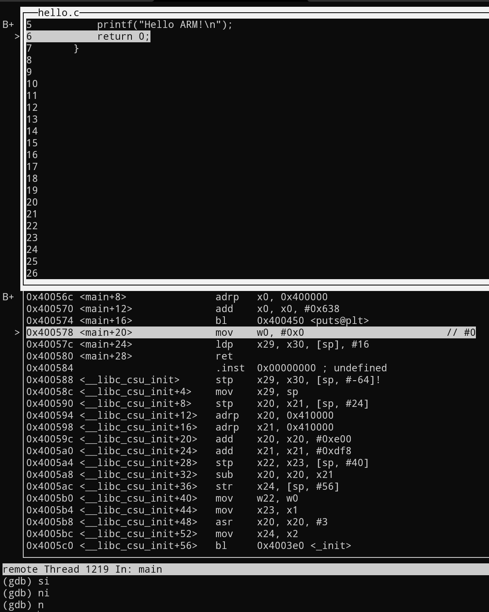

# 环境准备

- 安装编译调试组件
    - 由于手头只有带有WSL的x86环境，需要采用模拟执行的方式编译运行和调试arm程序
    - 参考这篇[gist文章](https://gist.github.com/luk6xff/9f8d2520530a823944355e59343eadc1)，可实现在x86环境上通过执行armv8程序，有以下几个步骤
        - 在WSL上安装
            - 交叉编译环境：`sudo apt-get install libc6-dev-arm64-cross gcc-aarch64-linux-gnu`
            - QEMU模拟环境：`sudo apt-get install qemu qemu-system qemu-user`

<!-- more -->

- 编译运行命令
    - 准备源代码`hello.c`，内容一般是打印`hello ARM`之类的
    - 静态链接编译：`aarch64-linux-gnu-gcc -static -ohello hello.c`
        - 优点：运行不需要依赖动态库，指令执行地址确定
        - 缺点：编译出的二进制体积较大，依赖库升级比较麻烦
    - 静态编译运行：`qemu-aarch64 hello`
    - 动态链接编译：`aarch64-linux-gnu-gcc -ohello hello.c`
        - 运行需要指定动态链接库目录
    - 动态编译运行：`qemu-aarch64 -L /usr/aarch64-linux-gnu/ hello`
- 调试命令
    - 根据这篇[文章](http://ubuntuforums.org/showthread.php?t=2010979&s=096fb05dbd59acbfc8542b71f4b590db&p=12061325#post12061325)以及[stackoverflow](https://stackoverflow.com/questions/20590155/how-to-single-step-arm-assembly-in-gdb-on-qemu)的讨论，可以通过安装gdb-multiarch来调试程序
    - 编译选项加入取消地址随机化的和编译带调试符号的选项
        - `aarch64-linux-gnu-gcc -fno-pie -ggdb3 -no-pie -o hello hello.c`
    - 运行选项同样指定动态链接库目录
        - `qemu-aarch64 -L /usr/aarch64-linux-gnu/ -g 10101 ./hello`
    - 新开窗口通过gdb-multiarch连上10101端口进行调试
```shell
gdb-multiarch -q --nh \
  -ex 'set architecture aarch64' \
  -ex 'set sysroot /usr/aarch64-linux-gnu/' \
  -ex 'file hello' \
  -ex 'target remote localhost:10101' \
  -ex 'break main' \
  -ex continue \
  -ex 'layout split'
;
```

调试的示例如下，可以通过分割layout查看调试的源代码和汇编指令等，比较方便。可以看到printf实际上是调用到libc提供的puts是实现的，有gdb之后单步调试就比较方便了。



通过以上的配置，基本就可以愉快的开始调试和学习Arm-v8汇编了。
