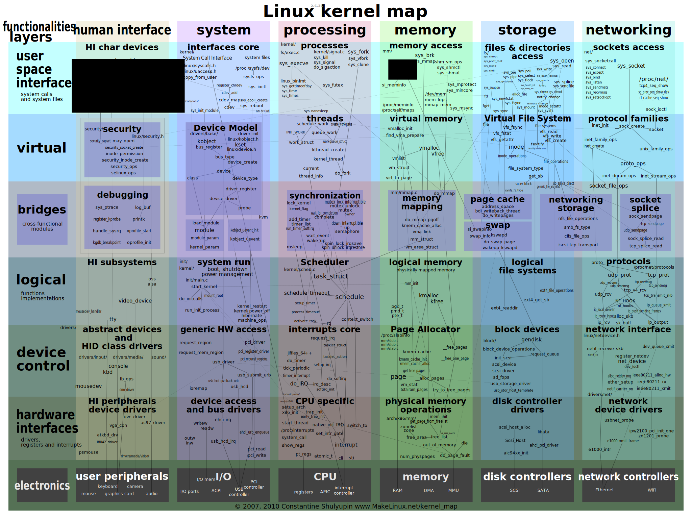

# 全景

<!-- more -->

从linux内核全景图看会被众多子系统淹没而不知所措，一个思路是以linux维测工具的功能切片视角观察内核的功能。

# 中断子系统

- 中断
    - `硬中断`
    - `软中断`
    - 中断嵌套
        - `硬中断`可嵌套
        - `软中断`不可嵌套
    - `硬中断`和`软中断`区别
        - `软中断`是执行中断指令产生的，而`硬中断`是由外设引发的。
        - `硬中断`的中断号是由中断控制器提供的，`软中断`的中断号由指令直接指出，无需使用中断控制器。
        - `硬中断`是可屏蔽的，`软中断`不可屏蔽。
        - `硬中断`处理程序要确保它能快速地完成任务，这样程序执行时才不会等待较长时间，称为上半部。
        - `软中断`处理`硬中断`未完成的工作，是一种推后执行的机制，属于下半部。

# 其他子系统

TODO

# 参考文献

[1]	https://makelinux.github.io/kernel/map/
