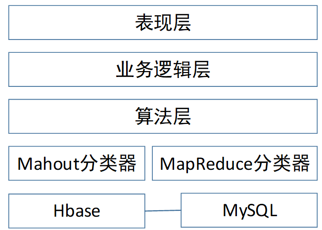
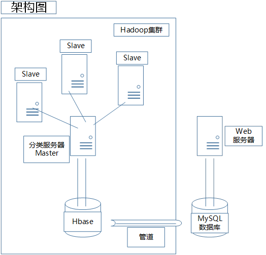
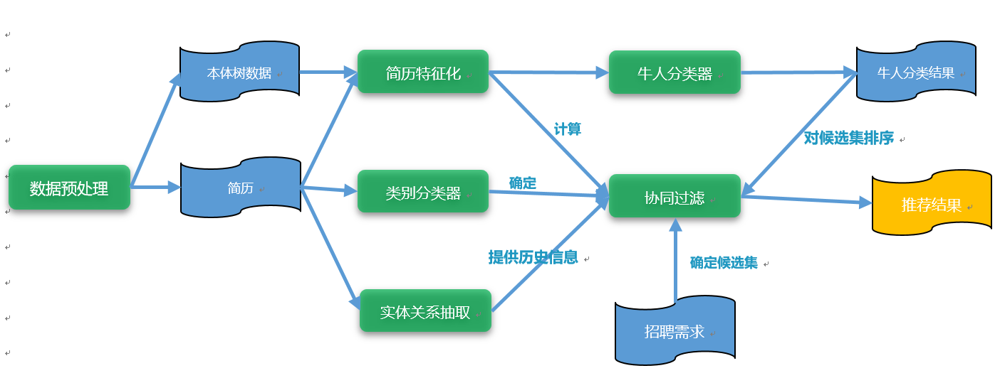
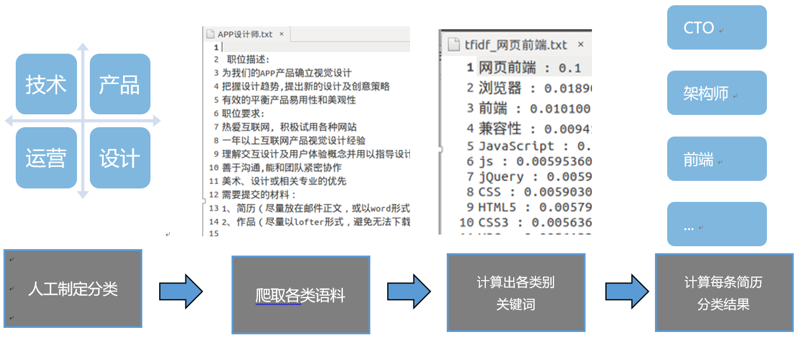
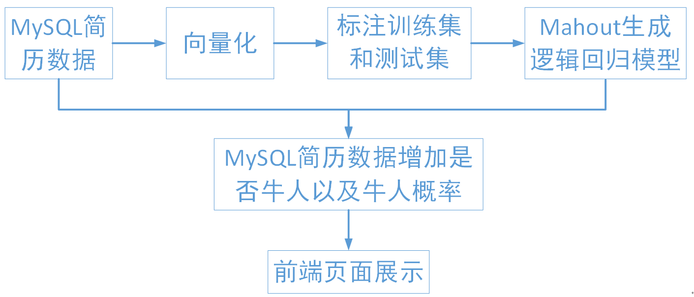
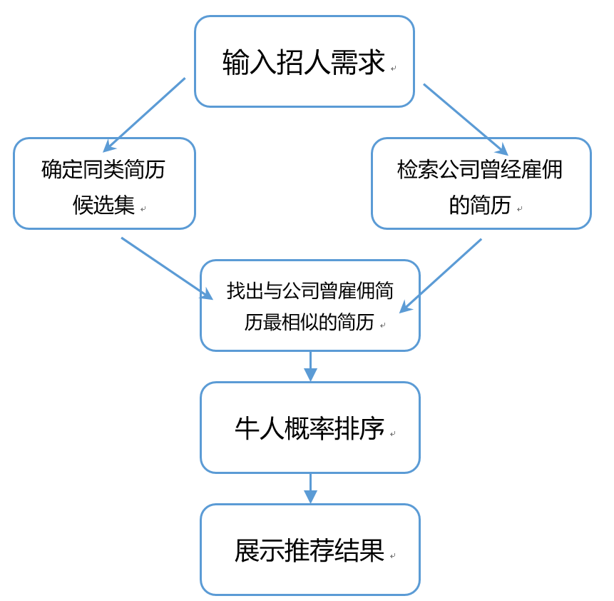
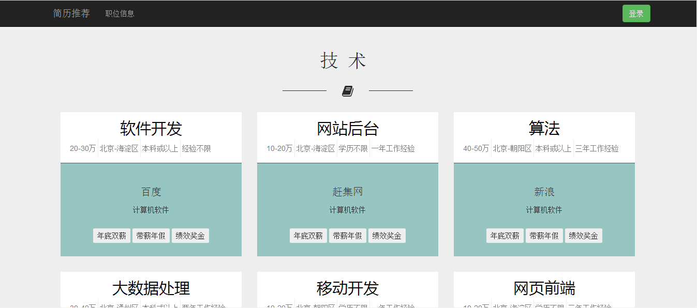

本系统采用机器学习方法与大数据平台训练海量的求职者的简历，不同于普通的条件筛选，该系统能高效准确地从大数据处理角度就IT类招聘方所要招聘的岗位提供合适可靠的人才推荐，减小招聘方的招聘成本，让大数据技术拉近招聘方与优秀人才的距离。

对海量简历数据和公司招聘信息进行研究，分析描述个人简历、公司以及公司职位的特征信息，站在招聘者的角度，围绕个性化推荐技术进行探索研究，以帮助招聘人员以更准确、更高效的方式获取人才信息。基于该思想实现一个原型系统，该系统可以根据招聘职位的特征来自动为其推荐更合理的简历。

<!-- more -->

当今是一个信息大爆炸的年代，随着网络求职的火热，每天网络上会产生大量的简历，对于招聘方来说，传统的人工简历筛选方法虽然筛选效果较好，但是这种方法不但耗费时间而且需要大量的人力物力与资金，而通过网络系统的简单条件筛选虽然可以缩短选拔人才的过程，但是筛选出的简历效果不佳仍需人力的支持。因此，如何提高人才招聘的效率，从成千上万的求职简历中挑选最符合岗位需求的求职者成了研究的热点。本项目从大数据处理技术方面着手研究如何为招聘方个性化推荐他们需要的人才，从而提高招聘效率，降低运营成本。
国内如云猎头，58帮帮等为招聘方服务的网站提供了基本的检索功能，能根据用户提出的简单需求来筛选，但是并不能区分人才之间的差别，也没有考虑招聘方的历史用人记录来进行推荐，并没有提供为招聘方提供按需的个性化的求职者推荐这些服务。推荐系统方面，国内外有相当多的成功的例子，如国内音乐类的网易云音乐和豆瓣FM，国外商品推荐类如亚马逊推荐系统，但是没有见到应用于简历推荐系统的。推荐方面国内外有相当多的论文可以借鉴指导，但是简历推荐方面的不多。
近些年，网络的高速发展以势不可挡的形式席卷了各行各业，不论是新兴的手机业甚至是传统家电行业。服务业也是收到冲击的重要一环，网络由于它高速高效的特性，能有效减少社会服务的成本，诸如美团，58同城等例子，也印证了网络的这一特性。求职招聘是一个亘古不眠的话题，在现今的网络背景环境下，从大数据角度对网络上现存的大量的简历信息进行分析提取，能够为招聘方提供更好的解决方案，减少招聘的时间成本。

# 项目整体层次图与整体架构

项目基于hadoop大数据平台实现，总体采用离线增量部署的方案，底层采用高性能的Hbase数据库和供网页前端调用的MySQL数据库；数据库之上是运行于Hadoop平台上的Mahout牛人分类器和简历MapReduce分类器；中间层为算法层，在这一层中综合选取了多种分类算法用于提高结果的准确性；业务逻辑层用于处理前端页面接受的请求并将其交给合适的后台模块处理；表现层以良好的交互形式确保招聘者可以在本平台方便快捷的挑选人才。

项目采用离线增量形架构，分布式集群离线处理出所有数据以及结果，通过管道将结果输入到MySQL数据库，供网页端展示。

## 项目模块

## 简历分类流程

首先制订了IT行业大致的分类，然后爬取了各个领域类别的招聘需求作为语料，然后计算每个类别的关键字，最后计算每条简历的分类结果.

## 牛人分类器流程

首先对MySQL数据库中的106万条简历进行向量化处理，得到每条简历的10维向量，从中抽取出1300条简历进行人工标注，其中1000条作为训练集，300条作为测试集，通过mahout逻辑回归分类器生成牛人二分类的模型，使用该模型判断每条简历是否是牛人以及其牛人概率，得到的结果为每条简历2列属性供前端页面调用，根据牛人概率高低对简历的显示顺序进行排序。

# 推荐系统

## 系统流程图

系统大致流程是首先对输入的招人需求确定候选集，找出适合这个JD的简历。然后查找该JD对应的公司的历史雇佣情况，对历史雇佣人员求出数据中心向量，并在这个范围内找出与该公司历史雇佣简历最相似的简历，然后根据牛人概率排序输出结果即可。

## 数据准备

1. 分类：给对应文本分类。
直接利用之前的分类程序即可。
2. 对应的若干人：处理出（公司，类别）二元组对应的所有简历。
Map-Reduce：将简历数据作为输入，得到其（公司，类别）二元组以及简历id。将该数据插入到新表（公司表）中，行键为公司，列名为类别，值为简历id。
3. 候选集：给简历分好类。
Map-Reduce：将简历数据作为输入，key为简历内容，value为简历所属分类，在Mapper中计算得出value，并将分类属性添加到简历中。
4. 牛人概率：利用牛人分类给每一份简历添加“牛人概率”的属性值。
利用Mahout上的算法，训练得出推荐模型，并从中得到牛人概率

## 算法详细流程

1. 给JD确定分类。
2. 计算对应的若干人(之前已经在公司的相同类别任职过的人的简历)（向量）的数据中心。
3. 确认候选集：与JD类别相关的所有简历。
Map：利用类别属性，得出所有相同类别的的简历。输出的key为类别，value为简历id
4. 利用数据中心计算得出候选集中相似度最大的前100个简历。
Reduce：利用上一步得到的简历id，以及之前计算出来的数据中心，算出每一份简历与数据中心的距离。key为距离，value为简历id，达到按照距离排序的效果，并抽取出前100份简历。
5. 对候选集中的简历进行牛人判断（预先处理出来），用牛人概率对各简历进行排序。
6. 输出这一份简历列表输出到网页显示。

# 网页

## 首页

以下是首页展示

## 招聘信息页

以下是招聘信息页面展示

## 求职人员推荐页

以下是求职人员推荐页面展示

## 简历详细信息页

以下是简历详细信息页面展示

