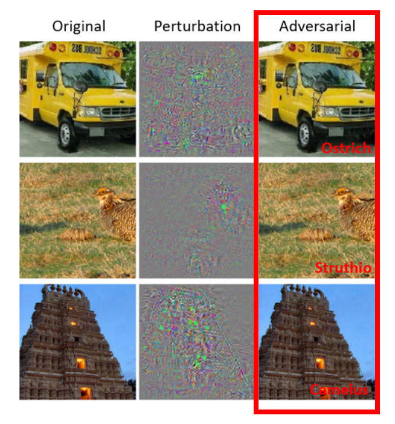
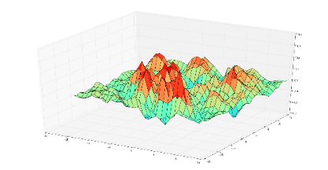
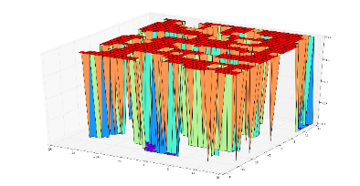
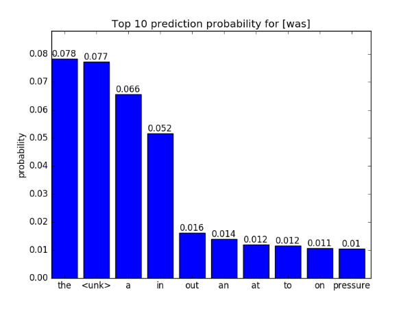
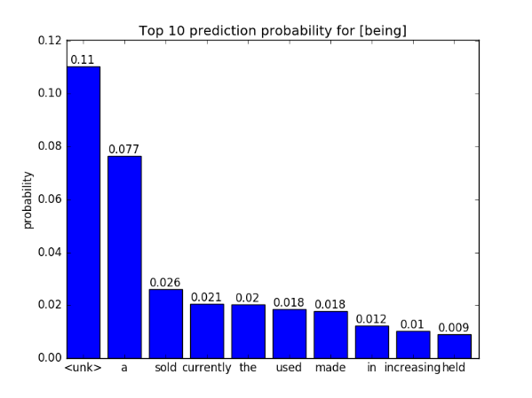
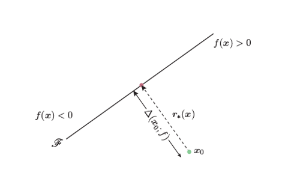
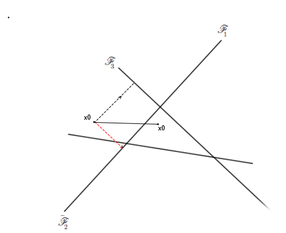
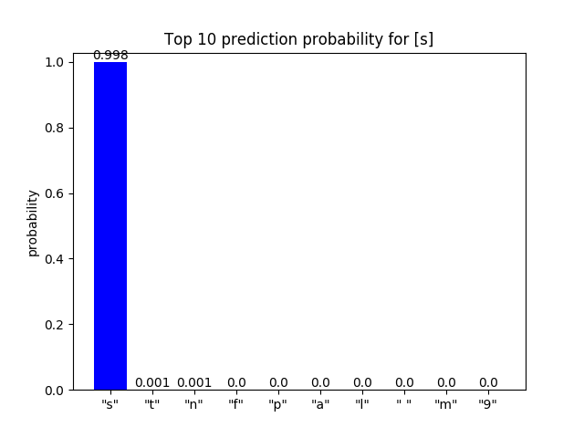
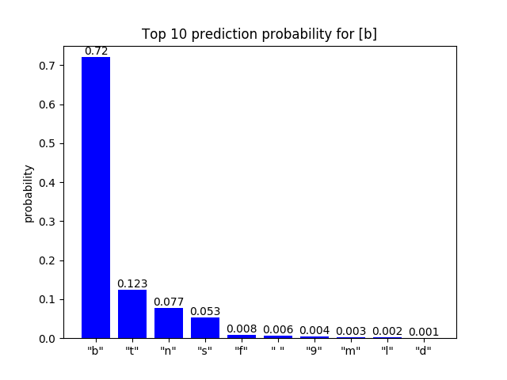

本文是2018年秋季计算语言学课程第6次作业的总结，任务为基于RNN生成对抗输入序列。

首先总体介绍一下对抗样本攻击的概念，一些研究人员发现尽管深度神经网络具有很高的精确度，但是通过对输入进行微小的扰动，会导致模型预测结果完全错误。对于图片来说，这样的扰动通常十分微小而不能被察觉（人类直观上感觉不到图片的扰动），但这些对抗输入样本却能成功地欺骗深度学习模型。这种欺骗神经网络模型的攻击类型大致分为2类，非导向性攻击只需要使得图片的预测结果与先前标签不一致，而导向性攻击则需要把图片错误预测成特定的类别。值得注意的一点是研究人员发现生成的对抗样本对其它的模型仍然有效，这就是对抗样本的可迁移性。

<!-- more -->

这里展示的结果主要是在卷积神经网络CNN上生成的对抗样本：

# 生成PTB语言模型的对抗输入序列

## 模型准备

首先尝试运行tensorflow提供的语言模型训练[代码](https://github.com/tensorflow/models/blob/master/tutorials/rnn/ptb/ptb_word_lm.py)，经过运行发现该代码仅打印模型的perplexity，没有提供输入一段话/一个词，预测下一个词的接口，因此又参考了Rani Nelken在GitHub上基于PTB语言模型训练代码修改的[版本](https://github.com/nelken/tf/blob/master/ptb_word_lm.py)，其不同之处在于：

- 建立了数字id到单词id的互相映射
- 微调了RNN的结构，主要修改了RNN的output到计算loss的过程，保留中间结果logits从而得到下一个词预测的概率
- 修改了读取文件的代码，每轮迭代返回test文本中的上一个词x和下一个词y

根据Rani Nelken版本的代码，经过small参数的训练13轮后得到可以用于测试的语言模型权重。

## 对抗输入序列生成思路

这里模仿**FGSM**方法来生成对抗输入序列，首先对FGSM方法[1]进行简要介绍：
FGSM方法是Ian Goodfellow等人在2015年提出的计算对抗扰动的方法。FGSM利用高维空间中深层网络模型的“线性”性质（而此时此类模型通常被认为是高度非线性的）来高效生成大量的对抗样本。
Fast Gradient Sign Method(FGSM)方法计算扰动的公式如下：

$$p = \epsilon sign(\nabla J(\theta,I_c,l))$$

其中$I_c$代表原始图片，$l$是错误分类的类别标记，$\theta$是神经网络的参数，$\nabla J$表示计算当前原始图片$I_c$对于网络模型参数$\theta$的梯度，$sign$是示性函数（将原本非线性的扰动变为线性的扰动），定义如下：

$$
sign(x) = \begin{cases}
1, & x>0 \\
0, & x=0 \\
-1, & x<0 \\
\end{cases}
$$

而$\epsilon$的作用是限制扰动的强度在尽可能小的范围内。下面的2张图分别直观的展示了原始梯度和示性函数处理后梯度的例子

|原始梯度|示性函数处理后梯度|
|:---:|:---:|
|||

而在语言模型的执行过程中，计算扰动p的公式如下：

$$p = \epsilon \nabla J(\theta,I_c,l)$$

其中$I_c$代表原始输入序列对应的embedding，$l$是RNN输出的final state的output计算logits后分类的类别标记，$\theta$是神经网络的参数，$\nabla J$表示计算当前输入序列对应的embedding $I_c$对于网络模型参数$\theta$的梯度，$\epsilon$是可以人为控制的扰动幅度。

这里没有使用示性函数$sign$的原因主要是考虑到扰动的数量级(大约为$10^{-3}$~$10^{-2}$)比embedding的数量级(大约为$10^{-1}$)要小，因此如果使用示性函数$sign$导致得到的扰动embedding过大，导致计算的距离较大，与“微小”扰动的目的相差较大。

由于RNN语言模型的输入序列是离散的，即输入的单词在转化为数字id后，还经过一层embedding转化为向量再参与RNN的计算，即使直接将扰动p加在原始embedding $I_c$上，有很大的概率仍然不能直接将embedding转化一个单词id。因此这里使用计算最近的欧式方式将加上扰动后的embedding转化为某个距离最近的单词id，这样就改变了输入的序列。过程如下，其中$e$代表原始单词id对应的embedding，$p$代表扰动，$e^*$代表加上扰动后的embedding：

$$e^* = e + p$$

然后求解距离扰动embedding $e^*$最近的embedding对应的id，其中n为语料库单词的数目，在本实验中n=20000：

$$argmin_{id}{\sqrt{\sum_{id=0}^{n}(e^{*}-e_{id})^2}}$$

## 对抗输入序列生成结果

### 对抗输入序列示例

这里使用的原始测试输入序列为`{no it was n't}`，我们对倒数第2个单词`was`进行对抗输入序列的生成，通过添加求得的扰动得到对抗序列为`{no it being n't}`，这样我们就可以观察导数第2个单词的下一个词的预测概率的变化。

### 预测下一个词的概率分布可视化

|was的下一个词预测概率|being的下一个词预测概率|
|:---:|:---:|
|||

可以看到，对抗序列的下一个词的预测Top 10概率分布发生了变化，尤其是Top 1预测的词从`the`变成了`<unk>`。本实验仍然存在这一些不足，例如没有使用量化指标（例如perplexity等）来评估所生成对抗输入序列的质量。未来可以考虑加对抗序列加入语言模型的重训练过程。

# 生成seq2seq语言纠错模型的对抗输入序列

## 模型准备

这里采用的语言纠错模型来自于David Currie在Github上开源的[代码](https://github.com/Currie32/Spell-Checker/blob/master/SpellChecker.py)，其主要采用了基于seq2seq的encoder和decoder的网络结构，同时还使用了attention和双向LSTM等结构，其目的是训练英语语料的语言纠错模型，其示例如下：

> 原始序列：**Spellin** is difficult, **whch** is **wyh** you need to study everyday.
纠正序列：**Spelling** is difficult, **which** is **why** you need to study everyday.

> 原始序列：The first days of her existence in **th** country were **vrey** hard for Dolly.
纠正序列：The first days of her existence in **the** country were **very** hard for Dolly.

根据David Currie的代码，经过调整若干参数后进行训练后可以得到用于生成语言纠错模型的对抗输入序列的模型权重。由于训练参数等原因，实际纠错效果并没有作者演示的那样好，仍然会出现一些单词未能纠正的情况，不过这不会影响本次实验。

## 对抗输入序列生成思路

这里模仿**DeepFool**方法来生成对抗输入序列，首先对DeepFool方法[2]进行简要介绍：
给定一个分类器模型f，Moosavi-Dezfooli等人首先定义了一张图片的最小扰动r，使其分类结果k出错，如下列式子所示：

$$\Delta(x, \hat{k}) = min_r||r||_2, s.t.\ \hat{k}(x+r) \ne \hat{k}(x)$$

给出以上定义以后，Moosavi-Dezfooli 提出了DeepFool模型：**迭代方式计算给定图像最佳扰动方向**，在该扰动方向上，快速有效的生成大量的对抗样本。
以一个简单的二分类模型来看，生成对抗样本的方向如下图所示：

|二分类问题生成对抗样本方向|多分类问题生成对抗样本方向|
|:---:|:---:|
|||

FGSM和DeepFool的目的都是为了使得模型预测分类错误，因此需要变异原图片$x_0$，使得它朝着分类错误的方向移动，也就是梯度上升的方向变异（虚线箭头方向）。在二分类模型上，DeepFool和FGSM模型在扰动方向上没有区别，但在多分类问题上，却有很大的不同，具体的示意如上图所示。

在这个简单的三分类问题中，假设原图片$x_0$被模型分类为$y_1$，为了使之分类错误，FGSM模型会朝着$y_1$分类错误的方向，也就是图中红色箭头方向添加扰动进行变异。

而DeepFool方法认为，若将$x_0$移动到图中三角区域，则被分类错误的概率将大大增加，因此，基于此假设，DeepFool会同时计算出Top 1分类结果的梯度和Top 2分类结果的梯度，并将这两个梯度进行矢量相加，得到图片添加扰动的方向，即黑色实线为原图片$x_0$的变异方向。

而在语言纠错模型的执行过程中，计算扰动p的公式如下：

$$p = \epsilon \nabla J(\theta,I_c,\sum_{i=1}^4l_i - l_0)$$

其中$I_c$代表原始输入序列对应的embedding，$l_0$是RNN输出的预测序列中随机选择一个字母对应的final state的output计算logits后分类的Top 1类别标记，$\sum_{i=1}^4l_i$为分类的Top2 ~ Top5类别标记的矢量求和，$\theta$是神经网络的参数，$\nabla J$表示计算当前输入序列对应的embedding $I_c$对于网络模型参数$\theta$的梯度，$\epsilon$是可以人为控制的扰动幅度。

这里没有使用示性函数sign的原因同样主要是考虑到扰动的数量级(大约为$10^{-3}$~$10^
{-2}$)比embedding的数量级(大约为$10^{-1}$)要小，因此如果使用示性函数$sign$导致得到的扰动embedding过大，导致计算的距离较大，与“微小”扰动的目的相差较大。

由于RNN语言模型的输入序列是离散的，即输入的单词在转化为数字id后，还经过一层embedding转化为向量再参与RNN的计算，即使直接将扰动p加在原始embedding $I_c$上，有很大的概率仍然不能直接将embedding转化一个单词id。因此这里使用计算最近的欧式方式将加上扰动后的embedding转化为某个距离最近的单词id，这样就改变了输入的序列。过程如下，其中$e$代表原始单词id对应的embedding，$p$代表扰动，$e^*$代表加上扰动后的embedding：

$$e^* = e + p$$

然后求解距离扰动embedding $e^*$最近的embedding对应的id，其中n为语料库单词的数目，在本实验中n=79：

$$argmin_{id}{\sqrt{\sum_{id=0}^{n}(e^{*}-e_{id})^2}}$$

## 对抗输入序列生成结果

### 对抗输入序列示例

这里使用的原始测试输入序列为

> Spellin i**s** difficult, whch is wyh you need to study everyday.

我们对第36个单词`o`进行对抗输入序列的生成，通过对每个可能的输入字母的embedding添加求得的扰动得到某一个对抗序列为

> Spellin i**b** difficult, whch is wyh you need to study everyday.

这2个序列的不同之处在于`is`的`s`被替换为`b`，这样我们就可以观察替换前后对应位置纠错字母预测概率的变化。

### 预测纠错词的概率分布可视化

可以看到，对抗序列的对应位置字母的预测Top 10概率分布发生了变化，尤其是Top 1预测的词从`s`变成了`b`，从纠正结果看`ib`并没有被纠正成为`is`。

|“s”的纠正词预测概率|“b”的纠正词预测概率|
|:---:|:---:|
|||

本实验仍然存在这一些不足，例如没有使用量化指标（例如perplexity或BLEU等）来评估所生成语言纠错模型对抗输入序列的质量；此外本方法生成的对抗序列仅限于对某一个字母进行替换，还未实现增加或删除的策略。未来可以考虑加对抗序列加入语言纠错模型的重训练过程。

# 参考资料

[1] Goodfellow, I. J., Shlens, J., & Szegedy, C. Explaining and harnessing adversarial examples (2014). arXiv preprint arXiv:1412.6572.
[2] Moosavi-Dezfooli, S. M., Fawzi, A., & Frossard, P. (2016). Deepfool: a simple and accurate method to fool deep neural networks. In Proceedings of the IEEE Conference on Computer Vision and Pattern Recognition (pp. 2574-2582).
