**Abstract** Sitting posture detection is helpful for preventing musculoskeletal disorders. With the development of motion-sensing camera and relative software development kit(SDK), it is possible to implement an application using skeleton detecting technology. In this paper, a method is introduced to detect sitting posture from a lateral view without disturbing the user. To analyse video stream information, a skeleton thinning algorithm is described and averaging process aims to locate main joints specifically from the lateral side. The results show this method has high accuracy when detecting improper sitting postures.
**Keywords** Ergonomics; Motion-sensing Camera; Gesture Recognition; OpenNI

<!-- more -->

# Introduction

Incorrect sitting posture is considered a danger to adolescent body growth. Prolonged sitting with wrong posture can cause a series of health problems. Former researches have pointed out the following consequences: back pain prevalence among children and adolescents; musculoskeletal discomfort and low back pain; biomechanical, circulatory and visual problems; awkward postures adopted for extended periods of time affect academic performance[1].
In the industrialized countries, musculoskeletal disorders are an important health problem. In modern society, the most common examples are disorders in back, shoulder and neck. According to a report conducted by National Institute for Occupational Safety and Health (NIOSH)[2], there is strong evidence that low-back musculoskeletal disorders and neck and shoulder musculoskeletal disorders are related prolonged and improper sitting postures. Angela et al.[3] finds occupational groups exposed to awkward postures while sitting have an increased risk of having low back pain.
People have developed some ideas and implementations to reduce the potential harms resulted from incorrect sitting posture. Using a motion-sensing camera is helpful to detect real-time sitting posture. Both the depth and three-dimensional coordinates information of the body can be obtained from the motion-sensing camera. Based on OpenNI and NiTE, the Portable Ergonomic Observation (PEO) model is applied on improper sitting posture detection. After analysing video streams and image processing, a threshold method is setup to locate main joints like neck and head. With the joints and medical research, improper sitting posture can be detected and defined.

# Related Work

## Artificial observation

Professionals use painting, photography or text description to record sitting posture for further analysis. From 1974, this kind of method has been fully developed, including Priel’s method[4], Ovako Working Posture Analyzing System[5], Posture Targeting Method[6] and Posture Recording Model[7].

## Video recording analysis

This method applies computer or video recording equipment to record user’s postures and movement. Then it uses a computer to analyze the user’s postures. Some cases implement real-time monitoring. Kind of method includes Rapid Upper Limb Assessment (RULA)[8], Rapid Entire Body Assessment (REBA)[9], Hand-Arm-Movement Analysis method (HAMA)[10] and Quick Exposure Check method (QEC)[11].

## Wearable sensor

Specialized sensors need to be put on the user’s body to collect information of sitting postures. The sensors include Sitting Posture Sensor, electromyogram (EMG) telemetry instrument, tri-axial accelerometers and skin-mounted electromagnetic tracking sensors[12][13].

# Hardware and Software

With the development of 3D motion-sensing cameras, a real-time image processing method is able to be implemented. PrimeSense, an Israeli company merged and acquired by Apple Inc. in 2013, developed the range camera technology in the first generation Kinect[14]. The OpenNI framework is an open source SDK used for the development of 3D sensing middleware libraries and applications[15]. The PrimeSense NiTETM is the most advance and robust 3D computer vision middleware. The algorithms utilize the depth, colour information received from the hardware device, which enable them to perform functions such as separation of users from background and accurate user skeleton joint tracking[16].

Fig. 1 shows the OpenNI SDK architecture.
Fig. 2 shows a motion-sensing camera.
Fig. 3 shows the Body joints tracked by OpenNI framework.

|Fig. 1: SDK architecture[15]|Fig. 2: motion-sensing camera|Fig. 3: Body joints tracked by OpenNI framework[17]|
|:---:|:---:|:---:|
||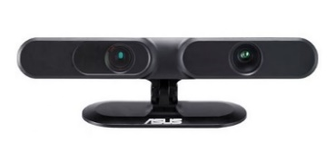|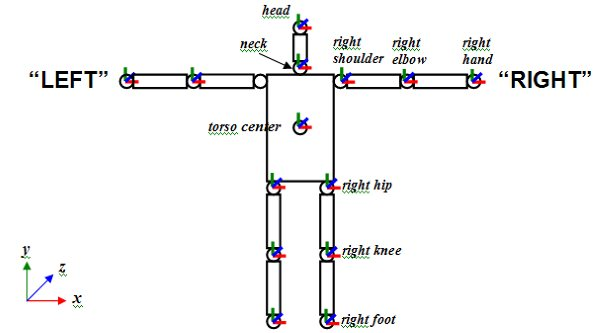|

# Detecting Improper Sitting Posture

## Lateral view of the user

Fig. 4 shows the setup of the experiment. The advantage of this setup is the view of camera would not be blocked by the desk. The following experiment is based on this setup.

|Fig. 4: Detect from the lateral side of the user|Fig. 5: Definition of hand position, neck and trunk flexion[18]|
|:---:|:---:|
|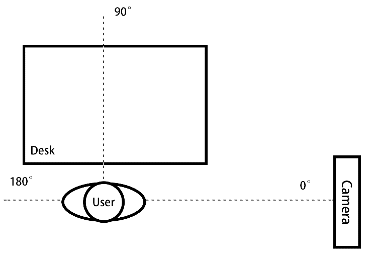|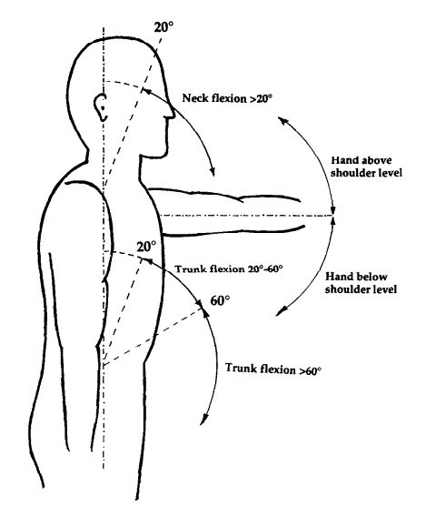|

## Apply PEO Model

### Preparation

The camera is placed on the table, 1.0 meter from the ground. The user sits on the chair, about 2.0 meters away from the camera. Make sure that the entire body appears in the view of the camera.

### Main skeleton and joints

From PEO model, Fig. 5 shows the definition of hand position, along with neck and trunk flexion. It can be seen that the effective joints are among the trunk, neck and head. Through observing the bodies forward posture, a threshold is chosen for neck and head to determine whether the sitting posture is awkward or not.
Therefore, an ideal healthy sitting posture needs to be defined. According to the research of O'Sullivan et al.[8], there are few differences between subjectively perceived ideal posture and tester perceived neutral posture. Therefore, this model uses the parameters of the PEO model.
This method focuses on neck flexion. Based on observations, humans tends to bend their neck when their body leans forward. Thus, the neck flexion can reflect the body posture.

### Analyse video stream

#### Find an active user in a specific scene

Thanks to the OpenNI and NiTE API, the user can be separated from the background and get all the data about the user. At first, the tester needs to move a few steps in front of the camera. Once his body is tracked, the area being tracked is monitored steadily. The user sits on the chair, the detection begins.
The resolution of the video stream is 320×240. Each pixel has its own coordinate in the frame and a depth property. The accuracy of the depth can reach one millimetre. The depth refers to the distance between the pixel in the real world and the camera. Fig. 10 shows the four detection steps which are introduced below.

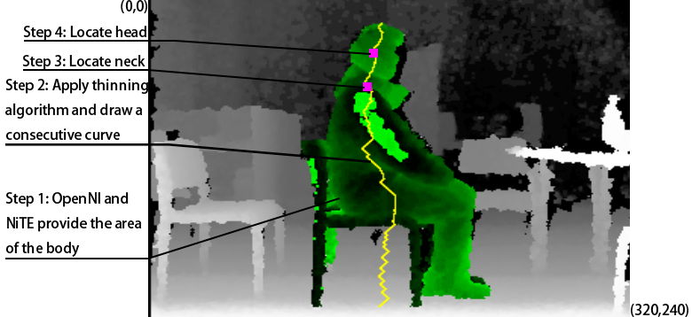

Fig. 6: Four steps of detection

#### Skeleton thinning algorithm

Here an algorithm is designed to reduce the area of the body to a consecutive curve. The curve consists of the head and neck that can be located in the next step.
The coordinate of the upper-left corner of the frame is set to (0,0), and the lower-right corner of the frame is set to (320,240). All of the pixels are checked in each frame row by row. After encountering a part of the body, each line of pixels is reduced to 1~2 pixels. In order to draw a consecutive curve, the pixels being marked must be adjacent to the pixels in the last row. Fig. 8 shows the flow chart of the algorithm. Fig. 7 shows the simulation process of thinning algorithm. Fig. 7 (a) shows the input of the algorithm. The green area refers to the body. Fig. 7 (b) shows all the midpoints of each row are marked as a blue triangle in the green area. Based on the rule of adjacent pixels, the yellow triangle would be marked. Fig. 7 (c) shows the result (yellow pixels) after the algorithm is completed.

|(a)Input|(b)Mark the pixels|(c)Output|
|:---:|:---:|:---:|
|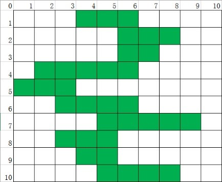|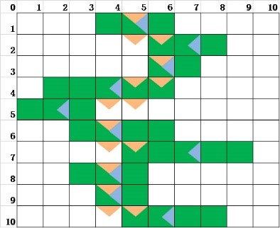|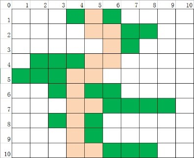|

Fig. 7: Example of skeleton thinning algorithm

|Fig. 8: Skeleton thinning algorithm|Fig. 9: Averaging process|
|:---:|:---:|
|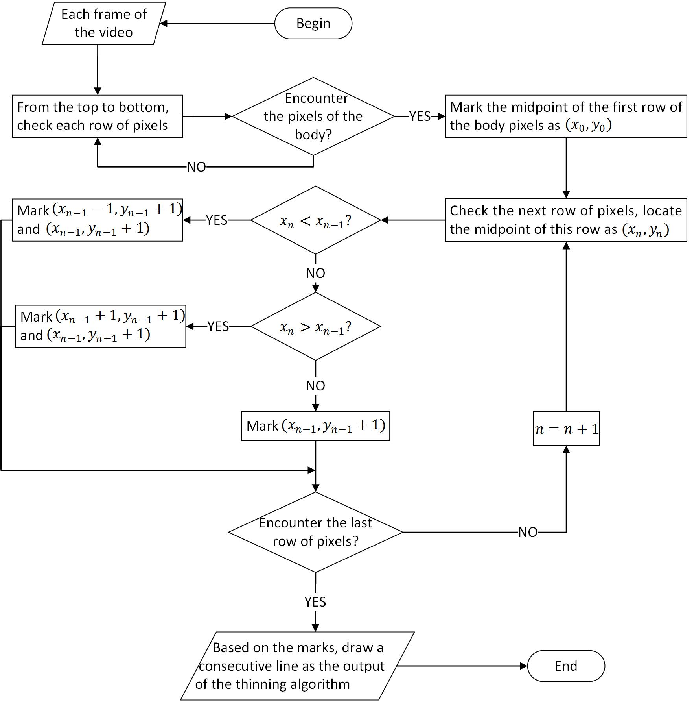|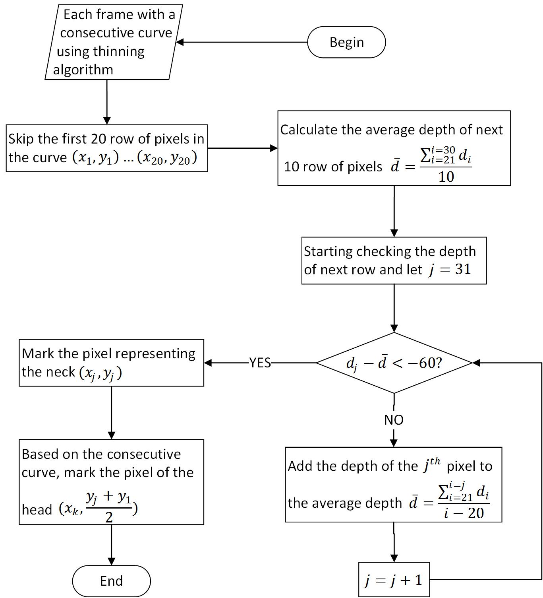|

#### Averaging process

Because the head of the user is perpendicular to the direction of the camera, the user’s arm is closer to the camera than the head through observation.
Considering the depths of the thinning line of the body. The depths of the head area change steadily. The depths of the arm area are lower than the depths of the head area because the arm is closer to the camera than the head. To locate the pixels which generate abrupt changes in depth, an averaging process is applied to deal with it.
Fig. 9 shows the flow chart of the averaging process. The first 20 row of pixels have the possibility of mixing with the background. These pixels are skipped to avoid the error caused by inaccurate depth in adjacent pixels. The depths of next 10 rows of pixels are averaged as the average depths of the head. The depth of next pixel continues to be averaged unless the depth meets an abrupt change(-60).
Fig. 10 shows the trends of raw depth and depth after averaging process. Fig. 11 shows the trends of raw depth difference and depth difference after the averaging process. There is no abrupt change in raw depth difference. The abrupt change happens in the 53th~68th pixel, where the depth is less than -40. Combining with observation, -60 is chosen as an abrupt change, which means the 57th pixel is approximate neck.
Then choose the midpoint between neck and the first pixel on the consecutive curve to identify the position of head. The midpoint is also on the curve. The number of pixels skipped and averaged is based on the distance between camera and user and the effect of detection. Thus the first 20 pixels are skipped.

|Fig. 10: Depth from top to bottom|Fig. 11: Difference in depth from top to bottom|
|:---:|:---:|
|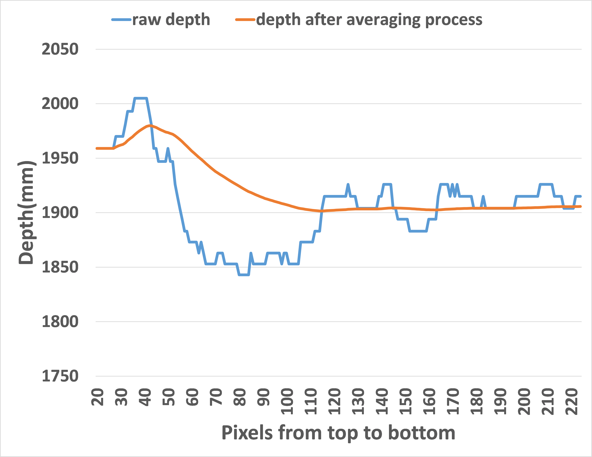|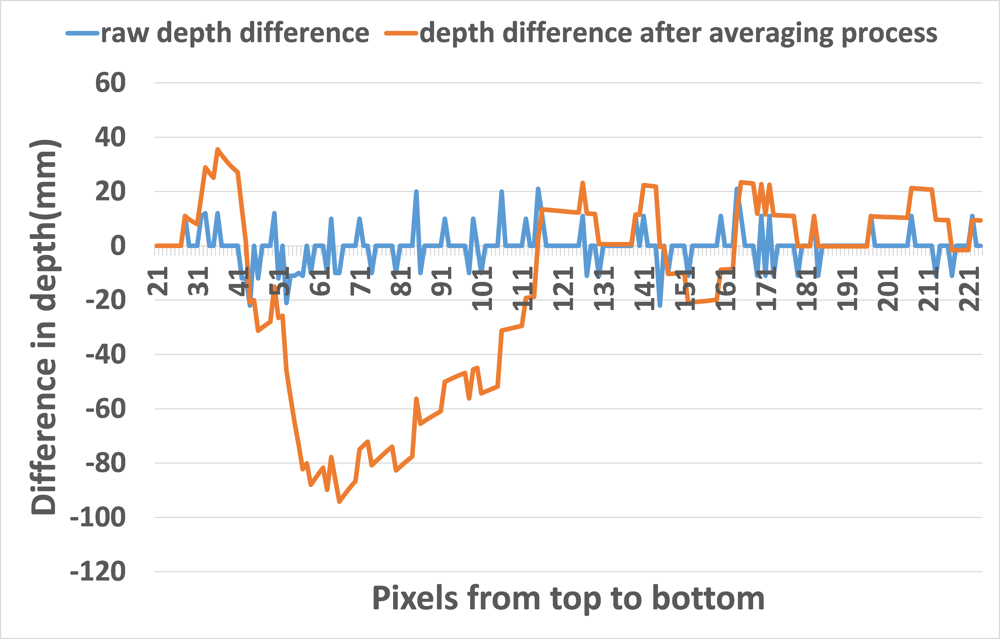|

#### Threshold

Chaffin and Kilbom found that there is strong evidence that shows positive correlation between musculoskeletal disorders and neck flexion over 20°[19]. With the position of neck and head, the flexion angle is defined as α which can be calculated as follows:

$$\alpha = \arctan{\left| \frac{x_{neck}-x_{head}}{y_{neck}-y_{head}} \right|}$$

OpenNI provides two different coordinate systems—depth coordinates and world coordinates. Depth coordinates are the native data representation. World coordinates superimpose a more familiar 3D Cartesian coordinate system on the world, with the camera lens at the origin[20]. Here the coordinates of neck and head are converted from depth coordinates and world coordinates to get xneck, yneck, xhead and yhead.
Once α exceeds 20°, the user would be alerted to inform him/her to correct sitting posture by sound. Hearing the alarm, the user should understand the sitting posture is improper and sit straight. When α is below 20°, sitting posture fits the health indicators, so keeps detecting without disturbing the user.

# Test and Evaluation

Fig. 4 shows the experiment environment. One volunteer was invited to perform a set of sitting postures. To test the accuracy of the method, the test includes 200 different improper sitting postures. There is no significant difference in the time of completing the track of the body among the tests. Based on identifying the joints and threshold method, the results of the test are shown in Table 1.

Table 1. TEST RESULT OF DETECTING THE SITTING POSTURE

| Total number of the improper sitting postures | Number of the detected improper sitting postures | Number of the undetected improper sitting postures |
| :---: | :---: | :---: |
| 200 | 188 | 12 |

In order to find whether factors like body shape and clothes affect the accuracy of the detection, five volunteers were invited to participate in the tests. The volunteers repeated making improper sitting posture for 50 times. The results are shown in Table 2.

Table 2. TEST RESULT OF DIFFERENT FACTORS

| Type of the factors | Height and weight | Total number of the improper sitting postures | Number of the detected improper sitting postures|
| :---: | :---: | :---: | :---: |
| Fat | 180cm 105kg | 50 | 50 |
| Thin | 174cm 62kg | 50 | 48 |
| Tall | 180cm 55kg | 50 | 48 |
| Short | 165cm 50kg | 50 | 47 |
| Thin clothes | 170cm 70kg | 50 | 50 |
| Thick clothes | 170cm 70kg | 50 | 47 |

# Conclusion

This paper presented a system aiming at detecting improper sitting posture with the technology of motion-sensing cameras. The system includes skeleton thinning algorithm, averaging process and threshold method. Detecting improper sitting posture provides a way to prevent musculoskeletal disorders. The experiment shows that this method can work efficiently, and is invariant to the user’s clothes and body shape.

# References

[1] Mebarki, B. (2009). Effect of school furniture design and traditional sitting habits,On sitting postures of middle school pupils in Touet region-Algeria. PROCEEDINGS OF 17TH WORLD CONGRESS ON ERGONOMICS.
[2] Putz-Anderson, V., Bernard, B. P., Burt, S. E., Cole, L. L., Fairfield-Estill, C., Fine, L. J., ... & Tanaka, S. (1997). Musculoskeletal disorders and workplace factors. National Institute for Occupational Safety and Health (NIOSH).
[3] Lis, A. M., Black, K. M., Korn, H., & Nordin, M. (2007). Association between sitting and occupational LBP. European Spine Journal, 16(2), 283-298.
[4] Priel, V. Z. (1974). A numerical definition of posture. Human Factors: The Journal of the Human Factors and Ergonomics Society, 16(6), 576-584.
[5] Karhu, O., Kansi, P., & Kuorinka, I. (1977). Correcting working postures in industry: a practical method for analysis. Applied ergonomics, 8(4), 199-201.
[6] Corlett, E. N., MADELEY†, S., & MANENICA‡, I. (1979). Posture targeting: a technique for recording working postures. Ergonomics, 22(3), 357-366.Gil, H. C., & Tunes, E. (1989). Posture recording: a model for sitting posture.Applied ergonomics, 20(1), 53-57.
[7] Gil, H. C., & Tunes, E. (1989). Posture recording: a model for sitting posture.Applied ergonomics, 20(1), 53-57.
[8] McAtamney, L., & Corlett, E. N. (1993). RULA: a survey method for the investigation of work-related upper limb disorders. Applied ergonomics,24(2), 91-99.
[9] Hignett, S., & McAtamney, L. (2000). Rapid entire body assessment (REBA).Applied ergonomics, 31(2), 201-205.
[10] Christmansson, M. (1994). Repetitive and manual jobs—content and effects in terms of physical stress and work‐related musculoskeletal disorders.International Journal of Human Factors in Manufacturing, 4(3), 281-292.
[11] Li, G., & Buckle, P. (1999). Evaluating change in exposure to risk for musculoskeletal disorders: A practical tool. HSE Books.
[12] Finley, M. A., & Lee, R. Y. (2003). Effect of sitting posture on 3-dimensional scapular kinematics measured by skin-mounted electromagnetic tracking sensors. Archives of physical medicine and rehabilitation, 84(4), 563-568.
[13] Wong, W. Y., & Wong, M. S. (2008). Detecting spinal posture change in sitting positions with tri-axial accelerometers. Gait & Posture, 27(1), 168-171.
[14] Microsoft, “PrimeSense Supplies 3-D-Sensing Technology to “Project Natal” for Xbox 360” [Online], Available: https://news.microsoft.com/2010/03/31/primesense-supplies-3-d-sensing-technology-to-project-natal-for-xbox-360/, [February 1, 2016].
[15] PrimeSense, Ltd., “What is OpenNI?”, [Online], Available: http://www.openni.ru/index.html, [February 1, 2016].
[16] PrimeSense, Ltd., “NiTE 2.2.0.11”, [Online], Available: http://www.openni.ru/files/nite/index.html, [February 1, 2016].
[17] NiTE, JointType, [Online], Available: http://img.my.csdn.net/uploads/201111/8/0_13207656556UXJ.gif, [February 1, 2016].
[18] Fransson-Hall, C., Gloria, R., Kilbom, Å., Winkel, J., Karlqvist, L., Wiktorin, C., & Group123, S. (1995). A portable ergonomic observation method (PEO) for computerized on-line recording of postures and manual handling. Applied ergonomics, 26(2), 93-100.
[19] O'Sullivan, K., O'Dea, P., Dankaerts, W., O’Sullivan, P., Clifford, A., & O’Sullivan, L. (2010). Neutral lumbar spine sitting posture in pain-free subjects. Manual therapy, 15(6), 557-561
[20] PrimeSense, Ltd., “openni::CoordinateConverter Class Reference”, [Online], Available: http://www.openni.ru/wp-content/doxygen/html/classopenni_1_1_coordinate_converter.html, [February 1, 2016]
