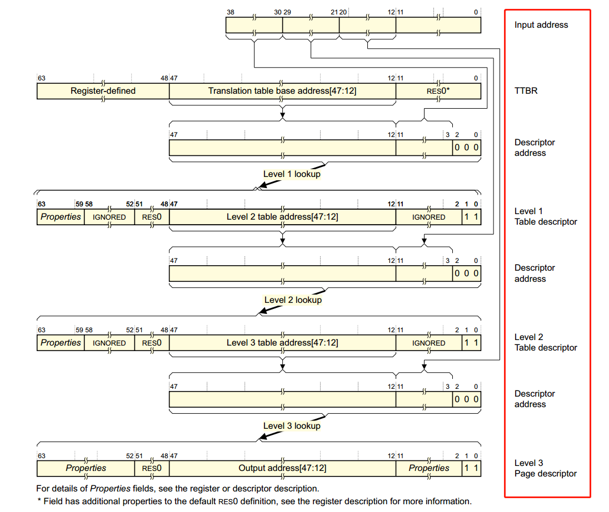

# 地址访问案例

以访问用户态**虚拟地址**0x0000007000003000为例，有如下代码。

```C
#include <sys/mman.h>
#include <stdio.h>

int main()
{
    unsigned long long *x = (unsigned long long)0x0000007000003000;
    int *p = (int*)mmap(0x0000007000003000, sizeof(unsigned long long) * 10, PROT_READ | PROT_WRITE, MAP_SHARED | MAP_ANONYMOUS, -1, 0);
    printf("before write, x = %llu\n", *x);
    *x = 1;
    printf("after write,  x = %llu\n", *x);
}
```

如果没有对用户态虚拟地址`0x0000007000003000`通过mmap提前进行映射并设置读写权限，会出现`Segmentation fault (core dumped)`，原因是`0x0000007000003000`并未再进程的虚拟地址空间通过mmap或者brk分配vma(vitrual memory area)进行管理，此时该虚拟地址是无法访问的。编译后输出的结果如下。

```
before write, x = 0
after write,  x = 1
```

可以看到成功向用户态虚拟地址`0x0000007000003000`写入了新的值。

<!-- more -->

# 地址访问后发生了什么

对虚拟地址`0x0000007000003000`进行mmap之后，从进程的视角看，建立了包含该地址的vma进行管理，但此时并未真正为该虚拟地址关联真正的物理地址，而此关联过程是通过**缺页**（page fault）实现的。

介绍下目前普遍集成在CPU内部的MMU（Memory Manage Unit）硬件，其起到的作用是从VA（virtual address）到PA（physical address）的翻译，可简单认为转换过程为`PA=MMU(VA)`或者`PA=page_table(VA)`。而目前MMU基本都是通过多级页表的过程完成地址的翻译过程，而在mmap映射虚拟地址后并未发生页表的建立过程，因此CPU在想要访问虚拟地址`0x0000007000003000`时，其MMU无法通过页表访问到对应的物理地址。

简而言之，缺页的过程的本质是告诉MMU在接收到虚拟地址作为输入后，如何通过页表访问到对应的物理地址。

# 缺页过程

当前进程处于EL0异常级别，页表的基地址保存在`TTBR0_EL1`寄存器中，值得注意的是`TTBR0_EL1`保存的物理地址，而且正是该进程用户态进程地址空间PGD页表的基地址，该地址空间中其余PGD页表的相对偏移（即`pgd_offset(mm,addr)`）都是以`TTBR0_EL1`保存的物理地址为基础进行偏移而得到的。

`printf("before write, x = %llu\n", *x)`代码的执行过程中引发对虚拟地址`0x0000007000003000`其中内容的访问，从而引发缺页异常（例如data abort或instrucion abort）被异常向量表捕获，通过预先注册的缺页异常类型处理的函数进入页表建立的流程，异常处理的汇编代码可以在`arch\arm64\kernel\entry.S`可以找到，代码片段如下。

```armasm
el0_da:
	/*
	 * Data abort handling
	 */
	mrs	x26, far_el1
	enable_daif
	ct_user_exit
	clear_address_tag x0, x26
	mov	x1, x25
	mov	x2, sp
	bl	do_mem_abort
	b	ret_to_user
el0_ia:
	/*
	 * Instruction abort handling
	 */
	mrs	x26, far_el1
	enable_da_f
#ifdef CONFIG_TRACE_IRQFLAGS
	bl	trace_hardirqs_off
#endif
	ct_user_exit
	mov	x0, x26
	mov	x1, x25
	mov	x2, sp
	bl	do_el0_ia_bp_hardening
	b	ret_to_user
```

可以看到对于data abort（例如访问某个变量），由`do_mem_abort`函数进行处理，对于instrucion abort（例如代码段执行某个地址的代码），由`do_el0_ia_bp_hardening`函数进行处理。之后会通过注册在`fault_info`内部的处理handler对具体的虚拟地址进行缺页处理，对应的处理函数有`do_translation_fault`和`do_page_fault`，对应代码位于`arch\arm64\mm\fault.c`。

进入`__do_page_fault`之后的逻辑基本和传统级联建立页表的过程类似了，过程中主要的操作有根据地址所在的vma设置对应权限、依次建立pgd\pud\pmd\pte页表等操作，最后走到匿名页缺页`do_anonymous_page`和文件页缺页`do_fault`的逻辑里，通过内核分配内存的接口，例如`alloc_pages`从伙伴算法或slab管理的物理内存里分配合适的page用于存放数据，最后通过`set_pte_at`将分配出的page的地址设置到对应的pte表项的内容，完成整个缺页过程，pte表项中除了保存page的地址外，还有upper attributes和lower attributes用于指示一些权限和flag标志位，具体可以参考[arm的官方手册](https://developer.arm.com/documentation/ddi0487/latest)中关于虚拟地址层级结构的章节。最后恢复保存的上下文，返回发生缺页的位置。

# 页表访问过程

这里以三级页表访问为例，首先虚拟地址0x0000007000003000按位划分如下表：

|0x0000|0x0070|0x0000|0x3000|
|:---:|:---:|:---:|:---:|
|<p style="text-align:left;">63<span style="float:right;">48</span></p>|<p style="text-align:left;">47<span style="float:right;">32</span></p>|<p style="text-align:left;">31<span style="float:right;">16</span></p>|<p style="text-align:left;">15<span style="float:right;">0</span></p>|
|0000 0000 0000 0000|0000 0000 0111 0000|0000 0000 0000 0000|0011 0000 0000 0000|

转化为按页表划分参与地址计算的结果如下表：

|ttbr-sensitive|pgd|pmd|pte|offset|
|:---:|:---:|:---:|:---:|:---:|
|<p style="text-align:left;">63<span style="float:right;">39</span></p>|<p style="text-align:left;">38<span style="float:right;">30</span></p>|<p style="text-align:left;">29<span style="float:right;">21</span></p>|<p style="text-align:left;">20<span style="float:right;">12</span></p>|<p style="text-align:left;">11<span style="float:right;">0</span></p>|
|0000 0000 0000 0000 0000 0|000 0111 00|00 0000 000|0 0000 0011|0000 0000 0000|
|该行表示末尾增加3个0之后的结果|0xE0|0x0|0x18|0x0|

根据下图所示的各级地址计算过程，大致说明下地址计算的过程。



首先根据TTBR0-EL1计算器得到进程pgd页表的基地址$addr_0$，和pgd页表对应的偏移按位做或操作，即

$$addr_{pgd} = addr_0\ |\ 0x18$$

这里$addr_{pgd}$地址即为该地址对应的pgd页表，保存的即为pgd表项指向的pmd表项的基地址$addr_1=*addr_{pgd}$。

访问$addr_1$物理地址所在的内容可以得到$addr_2$（对应于level 1 table descriptor），即$addr_2 = *addr_1$，这里$addr_2$结尾的0b11表示页表的大小是4k，不同的结尾位的值表示不同页表的大小，而对应的偏移为0，故pmd页表的位置为

$$addr_{pmd} = addr_{2}\ \&\ 0b00\ |\ 0x0$$

再访问$addr_{pmd}$地址可得$addr_3$（对应于level 2 table descriptor），即$addr_3 = *addr_2$，可以发现pte对应的偏移为0x18，所以去掉最后的0b11之后再按位或偏移可以计算出pte页表的位置为

$$addr_{pte} = addr_{3}\ \&\ 0b00\ |\ 0x18$$

对应的pte内容$addr_4 = *addr_{pte}$，由于虚拟地址最后12位都是0，所以$addr_4$里的对应[47:12]位内容即是物理页的地址，故最后page的物理地址为

$$addr_{page} = addr_4[47:0]\ \&\ 0x000$$

至此通过$addr_{page}$物理地址保存的内容，即$*addr_{page}$，可以查找到虚拟地址0x0000007000003000里保存的内容。

# 参考资料

[1] https://www.cnblogs.com/LoyenWang/p/11406693.html
[2] https://armv8-ref.codingbelief.com/zh/
